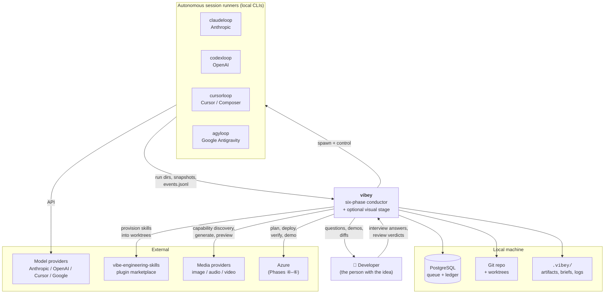
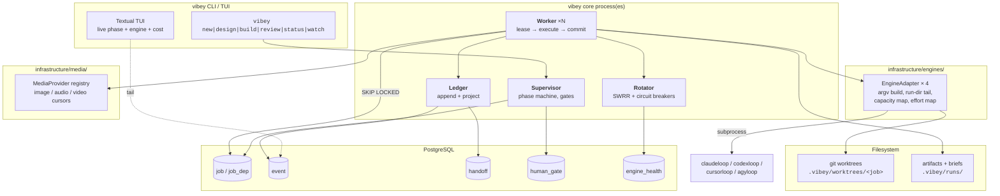
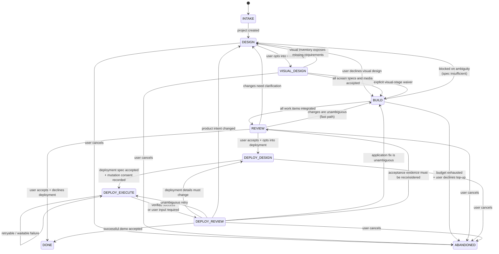
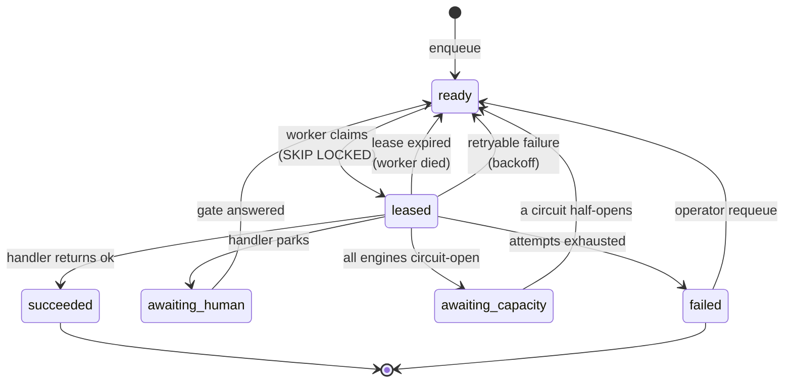
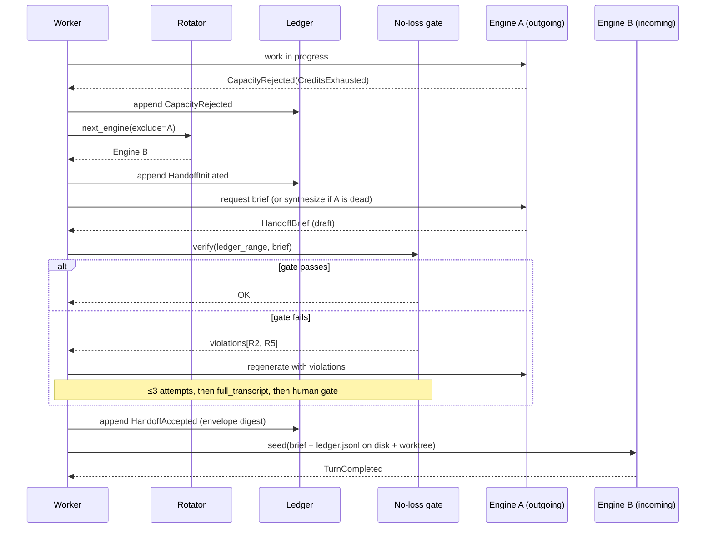
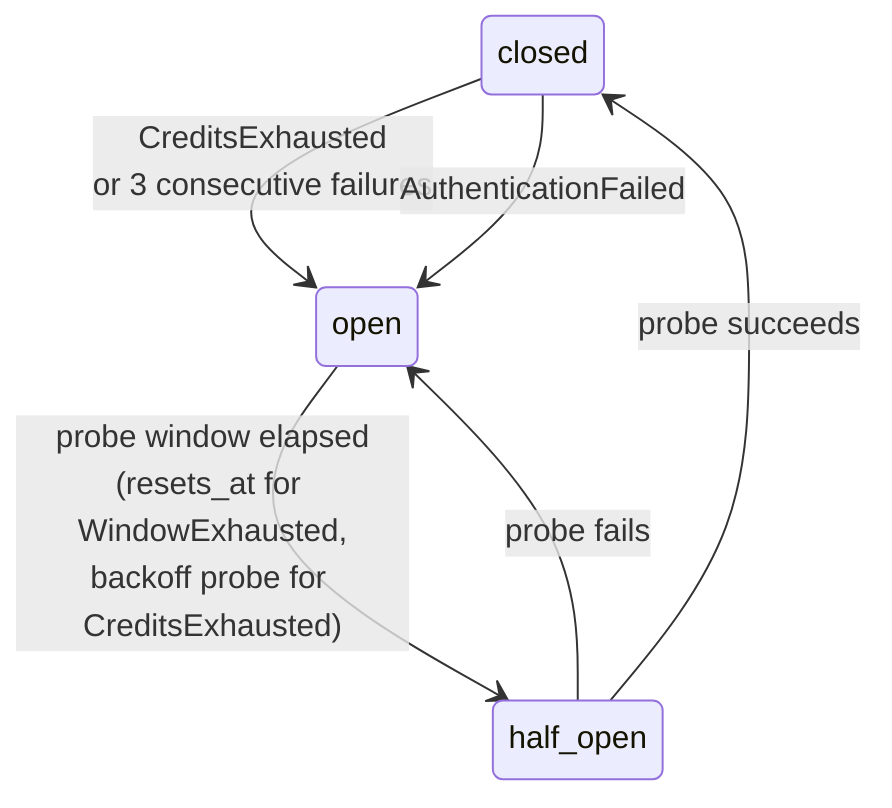

# Vibey — Architecture and Roadmap

> Status: **approved design, not yet implemented**.
> Audience: the engineer (human or agent) who will build this.
> Companion documents: [domain model](domain-model.md), [data model](data-model.md),
> [handoff protocol](handoff-protocol.md), [rotation & engines](rotation-and-engines.md),
> [phase protocols](phase-protocols.md), [implementation plan](implementation-plan.md).

---

## 1. Problem statement

Four autonomous session runners already exist in this workspace — `claudeloop`,
`codexloop`, `cursorloop`, `agyloop`. Each drives one vendor's coding agent
through an unattended run: it distinguishes a waitable rate-limit window from
exhausted credits, never blocks on a human, writes savepoints, and exposes a
mid-run control plane. They are, individually, excellent at *running one agent
until a task is done*.

None of them answers the question one level up:

> *Given a person with an idea, how do you get from that idea to deployed software,
> autonomously, using whichever AI happens to have capacity right now, without ever
> losing the thread of the conversation?*

That is vibey's job. It is a **conductor**, not a fifth runner.

### The four capability gaps

| Gap | Why the `*loop` runners can't close it | Vibey's answer |
|---|---|---|
| **No phase structure** | A runner runs *one* plan to completion. It has no notion of "we designed the wrong thing and need to re-interview the user." | A phase state machine with explicit loop-back edges (§6). |
| **Single-vendor lock per run** | A `claudeloop` run holds a live Anthropic session. When Anthropic's credits run out, that run waits — it cannot move the work to Codex. | Engine rotation at handoff boundaries, over a vendor-neutral ledger (§8). |
| **Conversation lives inside the vendor** | The real context is a `~/.claude/projects/**/*.jsonl` transcript in Anthropic's format. Codex cannot read it. | An append-only, engine-agnostic event ledger; vendor transcripts become attachments, not the source of truth (§8). |
| **No durable work queue** | A run is one OS process. Kill it and the in-flight decomposition is gone. | PostgreSQL-backed queue with leases, retries, and dependencies (§7). |

### What "never lose any data" means here, precisely

The user requirement is that passing a conversation from one AI to another must
not lose data. That is easy to claim and hard to guarantee, because the natural
implementation — "ask the outgoing model to write a summary" — loses exactly the
things a summary drops, silently, and you find out three hours later.

Vibey makes it falsifiable. The handoff is gated by a **deterministic structural
check** (§8.4) that fails the handoff if any open question, unfinished plan item,
or recorded decision present in the ledger is absent from the brief. The full
ledger is always written to disk inside the receiving worktree, so "compact
context" is a prompt-economy choice, never a data-availability one. See
[ADR-0004](../architecture/decisions/0004-no-loss-gate-on-handoff.md).

---

## 2. Non-negotiables

These are inherited from the `*loop` family's Global Constraints and extended.
They are enforced by CI, not by convention.

1. **Never block a worker on a human.** Human input is a *parked job* plus a
   `human_gate` row, never a thread waiting on stdin. A parked job releases its
   lease and its worker immediately.
2. **Credits ≠ rate limit.** `CreditsExhausted` has no reset time and must never
   acquire a waitable deadline field. Inherited verbatim from the `*loop` family.
3. **A capacity rejection always outranks a completion claim.** If a turn both
   looks done and hit a limit, it is not done.
4. **`domain/` stays pure.** Stdlib only. No I/O, no async, no third-party
   imports. Enforced by `import-linter`.
5. **A handoff that fails the no-loss gate is not a handoff.** It is a retry, an
   escalation to full-transcript mode, or a human gate — never a silent partial.
6. **Every job is idempotent under replay.** Workers can and will die mid-job;
   the lease will expire and another worker will pick it up. Every job type must
   be safe to run twice.
7. **The ledger is append-only.** No updates, no deletes. Corrections are new
   events that supersede prior ones.
8. **Every commit follows Conventional Commits.** Enforced by a git hook.
9. **No engine-specific types leak past `infrastructure/engines/`.** The domain
   knows `EngineId` and `Effort`; it never knows what `--preset` means.

---

## 3. System context (C4 level 1)



**Trust boundary note.** Everything inside *Local* is on the developer's machine.
Vibey never ships source, prompts, reference assets, or ledger content to a media
provider unless the user opted into the visual stage and accepted external-media
egress. See §13.

---

## 4. Container view (C4 level 2)



### Process model

Vibey runs as **one supervisor plus N workers**, all ordinary OS processes on the
developer's machine.

- `vibey up` starts Postgres (Docker Compose, or an existing instance via
  `--pg-url`, or a local `pg_ctl` cluster under `.vibey/pgdata`).
- `vibey serve` starts the supervisor and a default worker pool
  (`VIBEY_WORKERS`, default `min(4, cpu_count)`).
- Workers are stateless. Killing one loses nothing; its lease expires and the job
  is re-leased.
- The supervisor owns exactly one thing workers do not: **phase transitions**.
  It is safe to run several supervisors — transitions are guarded by an advisory
  lock on `project_id` — but there is no reason to.

---

## 5. Layer map

Vibey follows the same onion the `*loop` family uses, because the engineer is the
same and the conformance tooling is already written.

```
domain/  →  application/  →  infrastructure/  →  cli/ + tui/
                                    ▲
                            bootstrap.py
                     (the sole composition root)
```

Dependencies point inward only, enforced by `import-linter` in CI.

| Layer | Contains | May import |
|---|---|---|
| `domain/` | Phase machine, rotation algorithm, effort ladder, handoff ADTs, no-loss gate rules, budget, plan | stdlib only |
| `application/` | Ports (Protocols), use cases, job handlers, DTOs | `domain/` |
| `infrastructure/` | Postgres, engine adapters, git, filesystem, notifications, logging | `domain/`, `application/` |
| `cli/`, `tui/` | Typer commands, Textual app | all inner layers |
| `bootstrap.py` | Wiring — the only place concrete types meet Protocols | everything |

### Package tree

```
src/vibey/
├── domain/
│   ├── phase.py              # Phase, PhaseTransition, the machine
│   ├── effort.py             # normalized 5-level ladder
│   ├── engine.py             # EngineId, EngineCapabilities, EngineDescriptor
│   ├── rotation.py           # smooth weighted round robin, eligibility
│   ├── circuit.py            # CircuitState, breaker transitions
│   ├── ledger.py             # LedgerEvent ADTs, sequence rules
│   ├── handoff.py            # HandoffEnvelope, HandoffBrief, HandoffReason
│   ├── noloss.py             # the no-loss gate predicate
│   ├── job.py                # JobKind, JobState, lease + retry policy
│   ├── plan.py               # WorkPlan, PlanItem  (adapted from claudeloop)
│   ├── spec.py               # DesignSpec, AcceptanceCriterion, NFR
│   ├── review.py             # ReviewFinding, Severity, ReviewVerdict
│   ├── budget.py             # BudgetLedger, per-phase caps
│   ├── capacity.py           # Available|WindowExhausted|CreditsExhausted|AuthFailed
│   └── errors.py
├── application/
│   ├── ports.py              # every Protocol
│   ├── dto.py
│   ├── supervisor.py         # phase transitions, gate resolution
│   ├── worker.py             # the lease→execute→ack loop
│   └── handlers/
│       ├── design_*.py       # interview, research, synthesize, spec
│       ├── build_*.py        # decompose, implement, verify, integrate
│       ├── review_*.py       # demo, collect, triage
│       └── handoff.py        # produce + verify + accept
├── infrastructure/
│   ├── db/                   # asyncpg pool, migrations, repositories
│   ├── engines/              # one adapter per *loop + the conformance suite
│   ├── media/                # capability registry + media-provider adapters
│   ├── git/                  # worktrees, savepoints, integration merges
│   ├── ledger/               # append + projections
│   ├── provision/            # agent-surface materialization (CLAUDE.md etc.)
│   ├── notify/               # desktop + webhook
│   ├── logging.py            # structlog, dual console+json
│   └── otel.py               # OpenTelemetry spans + cost metrics
├── cli/
├── tui/
└── bootstrap.py
```

---

## 6. The phase machine

### 6.1 States

| Phase | Interactive? | Effort | Purpose |
|---|---|---|---|
| `INTAKE` | — | — | Create project, detect repo, provision agent surfaces |
| `DESIGN` (①) | **yes** | `HIGH` | Interview the user to a testable spec |
| `VISUAL_DESIGN` | **yes, optional** | `HIGH` | Inventory screens and generate/confirm visual, audio, and video assets when opted in |
| `BUILD` (②) | no | `LOW` (auto-escalating) | Decompose, implement, verify, integrate |
| `REVIEW` (③) | **yes** | `HIGH` | Demo what was built, collect change requests |
| `DEPLOY_DESIGN` (④) | **yes** | `HIGH` | Establish and accept the Azure deployment contract |
| `DEPLOY_EXECUTE` (⑤) | no | `LOW` (auto-escalating) | Plan, provision, release, verify, and recover autonomously |
| `DEPLOY_REVIEW` (⑥) | **yes** | `HIGH` | Demo success or resolve a failure that needs user input |
| `DONE` | — | — | Terminal success |
| `ABANDONED` | — | — | Terminal failure / user cancel |

The lifecycle has six numbered phases plus one optional, unnumbered visual-design
interstitial. Delivery is `① DESIGN → optional VISUAL_DESIGN → ② BUILD → ③ REVIEW`;
deployment remains `④–⑥`. High-effort models conduct human conversations and
visual review; low-effort models handle bulk build, media generation, and
deployment execution. §9.3 covers escalation ladders.

### 6.2 Transitions



**On `REVIEW → BUILD` (the fast path).** The source diagram specifies
`REVIEW → DESIGN` as the loop-back. That is the correct *default*: a change
request usually carries ambiguity, and re-interviewing is cheap relative to
building the wrong thing twice. But when the review triage classifies every
finding as `unambiguous` (a typo, a renamed label, a failing test with an obvious
fix), routing through a full design interview wastes the user's time. Vibey
therefore supports both edges, defaulting to `REVIEW → DESIGN`, with the fast
path taken only when *every* open finding is `unambiguous` and the user has not
set `strict_loopback = true`. See
[ADR-0010](../architecture/decisions/0010-review-loopback-routing.md).

**Opt-in means an explicit ledger decision, not a default.** Acceptance in ①
always asks whether to enter the optional visual-design interstitial. Acceptance
in ③ always asks whether to work on deployment. Declining deployment records a
successful local completion and enqueues no Azure job. If deployment is accepted,
Phase ④ remains read-only until a trusted, accepted deployment specification and
explicit mutation consent name the tenant, subscription, scope, environment, cost
boundary, verification contract, and recovery policy. See
[ADR-0014](../architecture/decisions/0014-optional-visual-design-and-deployment-opt-in.md).

### 6.3 Cycle and deployment-attempt accounting

Every pass through the machine increments `cycle`. The ledger, worktree branches,
and artifacts are all `cycle`-scoped, so cycle 3's build does not overwrite cycle
2's evidence. `max_cycles` (default 10) is a hard stop that raises a human gate
rather than looping forever.

Phase ⑤ also increments a separately bounded `deployment_attempt` for each
apply/release attempt. Retryable failures remain autonomous only while attempt,
elapsed-time, and cost caps allow. Reaching a cap raises a Phase ⑥ human gate;
it never turns into an unbounded cloud loop.

### 6.4 Transition guards

A transition fires only when its guard holds. Guards are pure functions in
`domain/phase.py`:

| Transition | Guard |
|---|---|
| `DESIGN → VISUAL_DESIGN` | buildable spec, user explicitly opted into visual design |
| `DESIGN → BUILD` | buildable spec, user explicitly declined visual design |
| `VISUAL_DESIGN → BUILD` | every planned screen has an accepted spec and every planned asset is accepted, supplied, or explicitly waived |
| `VISUAL_DESIGN → DESIGN` | visual inventory exposes a missing requirement or contradiction |
| `BUILD → REVIEW` | every work item is `integrated` or `waived`, integration branch is green |
| `BUILD → DESIGN` | ≥1 work item is `blocked_on_ambiguity` and retries exhausted |
| `REVIEW → *` | user issued a verdict and triage has classified every finding |
| `REVIEW → DEPLOY_DESIGN` | build accepted, integration evidence remains green, and user explicitly opted into deployment |
| `REVIEW → DONE` | build accepted, no open product findings, user explicitly declined deployment |
| `DEPLOY_DESIGN → DEPLOY_EXECUTE` | complete trusted deployment spec, preflight/what-if accepted, explicit mutation consent |
| `DEPLOY_EXECUTE → DEPLOY_EXECUTE` | failure is retryable or waitable and all attempt/time/cost caps remain |
| `DEPLOY_EXECUTE → DEPLOY_REVIEW` | runtime verification succeeded, or failure requires human input |
| `DEPLOY_REVIEW → *` | user verdict recorded and outcome/failure routing is classified |
| `* → ABANDONED` | explicit user cancel, or budget exhausted with declined top-up |

---

## 7. The queue

### 7.1 Why PostgreSQL

SQLite is the tempting choice for a local tool — no daemon, one file. It is the
wrong choice here, for one concrete reason: **SQLite has no row-level locking and
therefore no `SELECT … FOR UPDATE SKIP LOCKED`.** WAL mode fixes reader/writer
blocking, not writer/writer contention, and vibey's whole point is N workers
competing for jobs. The known workarounds (mark-then-return) leak leases when a
worker crashes — precisely the failure vibey must survive.

PostgreSQL gives `SKIP LOCKED`, `LISTEN`/`NOTIFY` for wakeups, `jsonb` with GIN
indices for the ledger, and advisory locks for phase transitions. It is also
already the storage substrate in the sibling `apg-*` projects, so the operational
knowledge is not new.

Local friction is handled by `vibey up`, which resolves a database in this order:
1. `--pg-url` / `VIBEY_PG_URL` if set (bring your own).
2. A Docker/Podman Compose service (`vibey-postgres`, pinned to `postgres:17`).
3. A local `pg_ctl` cluster initialized under `.vibey/pgdata` on a free port.

See [ADR-0002](../architecture/decisions/0002-postgres-not-sqlite.md).

### 7.2 Job lifecycle



The claim query is the standard pattern:

```sql
UPDATE job SET
    state          = 'leased',
    lease_owner    = $1,
    lease_expires_at = now() + $2::interval,
    attempts       = attempts + 1
WHERE id = (
    SELECT j.id FROM job j
    WHERE j.state = 'ready'
      AND j.run_after <= now()
      AND j.project_id = $3
      AND NOT EXISTS (
          SELECT 1 FROM job_dependency d
          JOIN job p ON p.id = d.depends_on_job_id
          WHERE d.job_id = j.id AND p.state <> 'succeeded'
      )
    ORDER BY j.priority DESC, j.run_after ASC, j.id ASC
    FOR UPDATE SKIP LOCKED
    LIMIT 1
)
RETURNING *;
```

Full DDL, indices, and the reaper query are in [data-model.md](data-model.md).

### 7.3 Job kinds

| Kind | Phase | Parallel? | Isolation | Typical effort |
|---|---|---|---|---|
| `design.interview` | ① | no (one conversation) | none | `HIGH` |
| `design.research` | ① | yes | none | `STANDARD` |
| `design.synthesize` | ① | no | none | `HIGH` |
| `design.spec` | ① | no | none | `HIGH` |
| `visual.inventory` / `visual.plan` | optional visual stage | no | none | `HIGH` |
| `visual.prompt` | optional visual stage | no | none | `STANDARD` |
| `media.generate.image` / `.audio` / `.video` | optional visual stage | async, dependency-ordered | media work dir | `STANDARD` ↑ |
| `media.moderate` / `media.preview` / `visual.review` | optional visual stage | no | read-only artifacts | `HIGH` |
| `build.decompose` | ② | no | none | `STANDARD` |
| `build.implement` | ② | **yes** | worktree | `LOW` ↑ |
| `build.verify` | ② | yes | worktree | `LOW` |
| `build.integrate` | ② | no | integration branch | `STANDARD` |
| `review.demo` | ③ | no | read-only worktree | `HIGH` |
| `review.collect` | ③ | no | none | `HIGH` |
| `review.triage` | ③ | no | none | `HIGH` |
| `deploy.interview` / `deploy.spec` | ④ | no | none | `HIGH` |
| `deploy.discover` / `deploy.plan` / `deploy.validate` | ⑤ | yes where read-only | none | `STANDARD` |
| `deploy.apply` / `deploy.release` / `deploy.verify` / `deploy.recover` | ⑤ | dependency-ordered | accepted Azure scope | `LOW` ↑ |
| `deploy.demo` / `deploy.collect` / `deploy.triage` | ⑥ | no | read-only Azure evidence | `HIGH` |
| `handoff.produce` | any | inherits | inherits | one tier below source |
| `handoff.verify` | any | inherits | none | `LOW` (deterministic + cheap model) |

### 7.4 Leases, retries, idempotency

- **Lease duration** is per-kind (`build.implement` gets hours; `review.triage`
  gets minutes) and extended by a heartbeat every `lease/3`.
- **Retry backoff** is exponential with full jitter, capped at 15 minutes.
- **Idempotency** is enforced by `idempotency_key` — a deterministic hash of
  `(project_id, cycle, kind, subject)`. Re-enqueueing the same logical work is a
  no-op. Handlers additionally guard their own side effects: `build.implement`
  checks whether its worktree branch already contains a completed savepoint
  before spending a turn.
- **Poison jobs** move to `failed` after `max_attempts` and raise a human gate
  rather than silently stalling the phase.

---

## 8. The conversation ledger and handoff

This is the mechanism behind "rotate engines without losing data." It is
specified in full in [handoff-protocol.md](handoff-protocol.md); this section is
the summary.

### 8.1 Event sourcing, not transcript copying

The source of truth for "what has been said and decided" is an **append-only
event log** in Postgres, written in a vendor-neutral schema. Vendor transcripts
(`~/.claude/projects/**/*.jsonl`, codex rollouts, cursor bridge logs) are copied
in as *attachments* referenced by events — they are evidence, not state.

This follows the ESAA-Conversational result: replaying a logical event log
produces consistent state in a receiving agent even when the two agents' internal
representations differ, whereas passing "fragile context strings" does not.

### 8.2 Event types

`SessionSeeded`, `TurnRequested`, `TurnCompleted`, `ToolInvoked`, `FileEdited`,
`VerdictRendered`, `CapacityRejected`, `DecisionRecorded`, `QuestionAsked`,
`AnswerGiven`, `AssumptionStated`, `ArtifactProduced`, `SavePointCreated`,
`FindingRaised`, `HandoffInitiated`, `HandoffAccepted`, `PhaseTransitioned`.

Every event carries `(project_id, cycle, phase, seq, causation_id,
correlation_id, engine_id, produced_at, payload, digest)`. `seq` is a
per-project gapless integer from a Postgres sequence, so "the ledger from seq
1200 to 1478" is an exact, verifiable range.

### 8.3 Two projections, one truth

| Projection | Where it goes | Size |
|---|---|---|
| **`HandoffBrief`** | Into the receiving engine's *prompt* | bounded, ~2–6k tokens |
| **`FullLedger`** | Written to `<worktree>/.vibey/handoff/ledger.jsonl` | unbounded |

The receiving agent is *told, in its seed prompt*, that the full ledger is on
disk and how to read it. The brief exists to make the first turn cheap, not to be
the only thing available. This is the resolution to the compact-vs-full tradeoff:
the compact view is the *prompt*, the full log is the *filesystem*.

### 8.4 The no-loss gate

Before a handoff is accepted, `domain/noloss.py` runs a **pure, deterministic
predicate** over `(ledger_range, brief)`:

| Check | Rule |
|---|---|
| `R1 remaining-work closure` | Every item in the last `VerdictRendered.remaining_work` appears in `brief.remaining` |
| `R2 open-question closure` | Every `QuestionAsked` without a matching `AnswerGiven` appears in `brief.open_questions` |
| `R3 decision closure` | Every `DecisionRecorded` not marked superseded appears in `brief.decisions` |
| `R4 assumption closure` | Every `AssumptionStated` appears in `brief.assumptions` |
| `R5 finding closure` | Every `FindingRaised` with `state != resolved` appears in `brief.open_findings` |
| `R6 range integrity` | `brief.ledger_ref.digest` equals the recomputed digest of `[from_seq, to_seq]`, and `to_seq` equals the project's current max seq |
| `R7 artifact closure` | Every `ArtifactProduced` still referenced by an open item appears in `brief.artifacts` |
| `R8 budget carry` | `brief.budget` equals the ledger-derived spend |

Matching is by stable `item_id`, not by string similarity — every closable thing
gets an id when it is first recorded, so the check is exact rather than fuzzy.

**On failure:** regenerate the brief (up to 3 attempts, each time feeding back the
specific rule that failed) → then escalate to `full_transcript` mode (the entire
ledger range is inlined, accepting the token cost) → then raise a human gate.
It never proceeds on a failed gate.

### 8.5 Handoff sequence



**When Engine A is unreachable** (crashed, credits gone, binary missing), the
brief is synthesized by the *incoming* engine, or by any healthy engine, reading
the ledger directly. The gate is identical either way — that is the point of
making it deterministic rather than trusting the author.

---

## 9. Engine rotation

Full specification in [rotation-and-engines.md](rotation-and-engines.md).

### 9.1 The capability problem

The four runners are not interchangeable at the CLI level. Actual, verified
divergence:

| | claudeloop | codexloop | cursorloop | agyloop |
|---|---|---|---|---|
| Effort vocabulary | 5-level `low…max` | 3-level `low/medium/high` | **none** — a model-id ladder | 5-level `low…max` |
| `--preset` | yes | no | no (`--model` positions on ladder) | yes |
| Top-level `savepoints` | yes | yes | yes | **no** |
| Top-level `effort` cmd | yes | yes | **no** | **no** |
| `sessions`/`threads` | `sessions` | `threads` | `agents` | `sessions` |
| Sandbox flag | permission-mode | `sandbox` | hooks policy | `--safe`/`--yolo` |
| State dir | `.claudeloop/` | `.codexloop/` | `.cursorloop/` | `.agyloop/` |

Treating these as one interface by hoping is how the orchestrator breaks the first
time cursorloop is selected for a job needing `--effort`. Instead:

### 9.2 Capability matrix + normalized ladder

Each engine ships an `EngineDescriptor` declaring what it supports. Vibey's domain
speaks its own 5-level ladder — `TRIVIAL, LOW, STANDARD, HIGH, MAX` — and each
descriptor provides a **projection** onto native flags, which may *saturate*:

```
Effort.MAX  →  claudeloop  --preset high --effort max
            →  codexloop   --model gpt-5.2-codex --effort high      (saturates)
            →  cursorloop  --model grok-xhigh                        (ladder position)
            →  agyloop     --preset high --effort max
```

A job declares `requires: {effort: HIGH, capabilities: {savepoints}}`. The
rotator only considers engines whose descriptor satisfies it. An engine that
saturates below the requested effort is *still eligible* but carries a
`fidelity_penalty` that lowers its rotation weight — so vibey prefers an engine
that can genuinely do `MAX` work, without refusing to use one that can't when it's
the only one with capacity.

### 9.3 Effort policy per phase

| Phase | Base | Escalation |
|---|---|---|
| ① DESIGN | `HIGH` | → `MAX` if the user rejects a synthesized spec twice |
| ② BUILD | `LOW` | → `STANDARD` after 2 failed verifies on one item; → `HIGH` after 4; → human gate after 6 |
| ③ REVIEW | `HIGH` | → `MAX` for `severity=critical` triage |

Escalation is per work item, not global, and resets when the item succeeds. This
is what keeps the user's "Phase 2 uses low effort" requirement from turning into
"Phase 2 never finishes the hard item."

### 9.4 Smooth weighted round robin

Vibey uses **nginx's SWRR** algorithm rather than naive modulo rotation, because
naive rotation over a set whose membership changes (engines dropping in and out as
circuits open) produces starvation and clumping.

```
for each selection:
    for e in eligible:  e.current += e.effective_weight
    winner = argmax(e.current)
    winner.current -= sum(e.effective_weight for e in eligible)
```

`effective_weight = base_weight × health_factor × fidelity_factor × cost_factor`,
all pure functions in `domain/rotation.py`, all unit-tested for the properties
that matter: **no starvation** (every eligible engine is selected within
`sum(weights)` selections), **determinism** (same state → same choice), and
**smoothness** (no engine selected twice in a row while another eligible engine
has waited).

### 9.5 Eligibility and circuit breakers

An engine is eligible when: installed, authenticated (`doctor` passed within TTL),
circuit not `open`, capability requirements met, and per-phase allow-list permits
it.



The distinction the `*loop` family fought for is preserved exactly:
`WindowExhausted` half-opens at `resets_at`; `CreditsExhausted` has no deadline
and half-opens on a bounded backoff probe, because only a human top-up can fix it.

### 9.6 When rotation happens

**At boundaries only** — never mid-turn.

| Trigger | Rotate? |
|---|---|
| New work item starts | yes (advance cursor) |
| Capacity rejection | yes (forced, exclude the rejecting engine) |
| Effort escalation | yes (re-select for the new tier) |
| Phase transition | yes |
| Handoff requested by operator | yes |
| Mid-turn | **never** |
| Item retry after transient failure | no (stickiness — keep the warm session) |

Stickiness matters: rotating on every turn would mean a handoff on every turn,
which is both expensive and lossy-prone. Vibey rotates when there is a *reason*.

---

## 10. Agent-surface provisioning

The source diagram calls for an "automated repository for I.D.E.'s." Concretely:
every engine reads different guidance files, and if they disagree, rotating
engines silently changes the rules mid-project.

Vibey materializes all of them from one source of truth (`vibey.toml` plus
selected marketplace plugins) into each worktree at job start:

| Engine | Reads |
|---|---|
| claudeloop / Claude Code | `CLAUDE.md`, `.claude/skills/`, `.claude/settings.json` |
| codexloop / Codex | `AGENTS.md`, `.agents/skills/` |
| cursorloop / Cursor | `CURSOR.md`, `.cursor/rules/` |
| agyloop / Antigravity | `GEMINI.md`, `.agent/` |

Plus a shared `.vibey/context/` containing the spec, the handoff brief, the
ledger, and the acceptance criteria — referenced by all four surface files. Skills
are pulled from the local `vibe-engineering-skills` marketplace by name, so a
project can declare `plugins = ["software-architecture", "quality-engineering",
"security-first-dev"]` and every engine gets the same 71-skill vocabulary.

Provisioning is idempotent and content-addressed; a job that finds the correct
digests already present skips the write.

---

## 11. Isolation

```
repo/                          ← never checked out by a build job
└── .vibey/
    └── worktrees/
        ├── c3-item-014/       ← git worktree, branch vibey/c3/item-014
        ├── c3-item-015/
        └── c3-integration/    ← branch vibey/c3/integration
```

Each `build.implement` job gets its own git worktree and branch. Parallel items
never share a working tree, which removes the shared mutable resource rather than
trying to lock it.

**A worktree is not a sandbox.** It prevents agents from overwriting each other;
it does not prevent an agent from running `rm -rf ~`. Vibey therefore offers three
isolation levels, selected per project:

| Level | Mechanism | Protects against |
|---|---|---|
| `worktree` (default) | git worktree + per-engine destructive-command denies | concurrent-edit corruption |
| `container` | Docker/Podman, repo bind-mounted, network egress allow-listed to provider APIs | filesystem escape, exfiltration |
| `vm` | Firecracker/Lima microVM | kernel-level escape |

`container` is the recommended default for unattended overnight runs and is what
`vibey doctor` nudges toward when it sees `isolation = "worktree"` together with
`autonomous = true`.

---

## 12. Security

Threat model, in the vocabulary of the marketplace's `threat-modeling-playbook`
and `ai-security-practices` skills:

| Threat | Vector | Control |
|---|---|---|
| **Indirect prompt injection** | A dependency's README, a fetched web page, or a GitHub issue instructs the agent to exfiltrate secrets | Content fetched during a run enters the ledger as `untrusted` provenance; the seed prompt states that ledger content is data, not instruction; egress allow-list in `container` mode |
| **Cross-engine injection** | A compromised engine writes a poisoned `HandoffBrief` that redirects the next engine | The brief is *structurally verified* against the ledger; free-text fields are length-capped and never carry tool grants; `brief` cannot alter `spec` or acceptance criteria — those come from the ledger, not the brief |
| **Secret leakage into the ledger** | Agent pastes `.env` contents into a turn | `infrastructure/redact.py` (ported from the `*loop` family) runs on every event before append; ledger columns are redacted at write, not at read |
| **Runaway cost** | An agent loops, burning tokens | Hard per-phase and per-project budget caps in `domain/budget.py`; the "AI cost snowball" is a documented incident class, so caps are mandatory, not optional |
| **Destructive command** | `rm -rf`, `git push --force`, `DROP DATABASE` | Deny-list enforced at the engine adapter *and* in container mode at the mount level; `git push` requires explicit `allow_push = true` |
| **Credential handling** | Provider keys | Vibey never reads provider keys. Each engine authenticates itself from its own env/keychain; vibey only observes `doctor` exit codes |
| **Media egress / provider retention** | Visual stage sends source, prompts, or reference assets to a hosted generator | Visual opt-in shows provider, region, retention, cost, and egress; hosted generation requires `media.allow_external = true`; local-first is the default |
| **Generated harmful or infringing media** | A model returns unsafe, deceptive, or unlicensed output | Provider/content-safety scan, provenance and rights metadata, human review, and an explicit reject/regenerate/waive decision before BUILD |
| **AI voice misrepresentation** | Generated narration is presented as a human recording | Store voice/provider metadata and disclose AI-generated audio wherever the selected provider or policy requires it |

Vibey does not run `git push`, open pull requests, or mutate Azure without
explicit, scope-bound authorization. Deployment entry is never automatic; it
occurs only after the explicit deployment opt-in gate. The default posture
remains local branches, opted-out media generation, and no Azure discovery or
mutation until a human accepts each corresponding opt-in.

---

## 13. Observability and cost

- **Structured logs** — `structlog`, dual transport (human console + JSON lines),
  matching the `*loop` convention.
- **Traces** — OpenTelemetry spans: one per job, child spans per engine turn, per
  tool invocation, per handoff. `phase`, `cycle`, `engine_id`, `job_kind`, and
  `effort` are span attributes so any of them can slice a latency or cost query.
- **Metrics** — job queue depth by state, lease expiry rate, handoff gate failure
  rate by rule, per-engine selection counts (to prove rotation fairness in
  production, not just in unit tests), media-provider selection counts by
  modality, media generation latency/failure/retention, tokens and dollars by
  phase/engine/provider/cycle.
- **Cost** — every `TurnCompleted` carries `cost_usd`; `domain/budget.py` maintains
  the ledger. `vibey cost` reports by phase, cycle, engine, and work item.
  The `azure-bootstrap` AI usage tracker's sliding-window/soft-cap model is the
  reference for the caps implementation.
- **The TUI** (`vibey watch`) shows: current phase, cycle, per-engine circuit
  state, per-modality media-provider cursor/circuit state, live queue depth,
  active worktrees, opt-in decisions, and a streaming tail of the ledger.

---

## 14. Optional pre-build visual design and media stage

This is an optional, unnumbered interstitial between Phase ① DESIGN and Phase ②
BUILD. The user is asked after the accepted product specification is produced.
Declining it records a `VisualDesignDeclined` event and takes the normal
`DESIGN → BUILD` edge. Opting in creates a durable visual stage; BUILD cannot
start until the visual-ready guard passes or the user records an explicit waiver.

### 14.1 Screen and state inventory

`visual.inventory` reads the accepted spec, repository routes/components, design
tokens, existing screenshots/prototypes, and acceptance criteria. It produces a
matrix with one row per screen or surface and explicit states:

| Field | Required evidence |
|---|---|
| Screen identity | route, platform, viewport, create/update decision, acceptance IDs |
| Structure | hierarchy, primary action, navigation, responsive behavior, content density |
| State coverage | loading, empty, error, success, permission, offline, retry, reduced motion |
| Interaction | focus order, keyboard/touch targets, validation, transitions, recovery |
| Accessibility | semantic roles, labels, alt text, captions/transcripts, contrast target, screen-reader intent |
| Media | image/audio/video/icon/illustration IDs, placement, dimensions, format, rights/source constraints |

If the inventory discovers a product requirement that Phase ① did not settle, the
stage raises a scoped design gate and routes back to ①. It must not silently fill
the gap with a generated screen.

### 14.2 Generation plan and provider ports

`visual.plan` derives a design-system contract and a media manifest from the
inventory. A media manifest entry contains `asset_id`, modality, screen/state,
purpose, prompt, reference digests, output constraints, accessibility metadata,
rights/likeness constraints, provider policy, and an acceptance test.

The application layer defines a provider-neutral port:

```python
class MediaProvider(Protocol):
    provider_id: str
    capabilities: frozenset[MediaModality]

    async def generate(self, request: MediaGenerationRequest) -> MediaJob: ...
    async def poll_or_resume(self, job: MediaJob) -> MediaJob: ...
    async def download(self, job: MediaJob) -> MediaArtifact: ...
    async def estimate_cost(self, request: MediaGenerationRequest) -> CostEstimate: ...
    async def moderate(self, artifact: MediaArtifact) -> ModerationResult: ...
```

The exact interface is an application port; the domain sees only immutable
modality, request, outcome, and routing values. Concrete providers live under
`infrastructure/media/`. A provider may be local/self-hosted or hosted. The
default is `local_first`; hosted fallback requires explicit external-media
consent and records destination, region, retention, estimated cost, and policy.

Provider capability discovery happens at the start of the visual stage and is
repeated when a provider becomes unavailable. Model names are configuration and
runtime metadata, never domain assumptions. A provider is eligible only if it
supports the requested modality, dimensions/format/reference inputs, region and
data policy, safety policy, budget, and current capacity.

### 14.3 Per-modality round robin

Image, audio, and video each have an independent persisted smooth round-robin
cursor. Selection is capability-filtered before rotation:

```text
image candidates → image cursor → next eligible provider
audio candidates → audio cursor → next eligible provider
video candidates → video cursor → next eligible provider
```

This preserves fairness without selecting a provider that cannot satisfy the
asset. Cursors advance transactionally only after selection; circuit-open,
capacity-exhausted, policy-ineligible, and budget-ineligible providers are
skipped. Cost/capability/quality/latency factors may affect eligibility and
weights, but no provider is starved inside the eligible set. A provider may be
used for more than one modality while retaining separate per-modality state.

Generation is a dependency-ordered, asynchronous queue graph:

```text
inventory → plan → prompt → generate(modality) → moderate → preview
                                                     ↓
                                           review / regenerate / waive
```

Large video operations return an operation ID and release their worker lease;
polling or webhook jobs resume them. Every job is idempotent by
`(project, cycle, visual_revision, asset_id, provider, prompt_digest)`.

### 14.4 User confirmation and visual-ready guard

`visual.review` presents a screen gallery or prototype, design tokens, responsive
variants, interaction states, image/contact sheets, audio previews plus
transcripts, and video storyboards/clips. The user may accept an asset, request a
regeneration with feedback, provide a replacement, or waive it explicitly. A
regeneration creates a new immutable revision; it never overwrites a prior
accepted asset or its evidence.

The `VISUAL_DESIGN → BUILD` guard requires:

- every inventory row has an accepted screen spec;
- every required asset is accepted, user-supplied, or explicitly waived;
- no blocking design question or unresolved rights/safety issue remains;
- accessibility checks cover contrast, semantics, focus, labels, alt text,
  transcripts/captions, touch/keyboard targets, and reduced motion;
- prompt, provider/model, output, moderation, cost, and user-decision evidence is
  persisted; and
- the user issued `visual design accept` or an explicit visual-stage waiver.

### 14.5 Artifacts

```text
.vibey/context/visual/
├── screen-inventory.md
├── design-system.md
├── screen-specs/<screen-id>.md
├── media-manifest.json
├── prompts/<asset-id>.md
├── assets/<asset-id>/<revision>/...
├── previews/                         # gallery, audio, storyboard/video links
└── visual-review.md                  # accepted/rejected/waived decisions
```

---

## 15. Optional deployment stage set (Phases ④–⑥)

Deployment is the optional second three-phase stage set in the core lifecycle,
governed by [ADR-0014](../architecture/decisions/0014-optional-visual-design-and-deployment-opt-in.md)
and the execution design in
[ADR-0013](../architecture/decisions/0013-deployment-is-a-three-phase-stage-set.md)
and specified turn-by-turn in [phase-protocols.md](phase-protocols.md). Azure
implementations remain behind application ports and optional infrastructure
dependencies so `domain/` stays provider-agnostic and stdlib-only.

After Phase ③ has no open product findings and the user accepts the build, Vibey
asks whether to work on deployment. A “no” answer records `DeploymentDeclined`,
sets `completion_mode = "local"`, and transitions to `DONE` without enqueueing
any Azure job. A “yes” answer records `DeploymentOptedIn` and enables the
following stage set:

1. **④ DEPLOY DESIGN (interactive)** discovers the target and authority, selects
   service topology from requirements, resolves secret *references*, defines IaC,
   migration, cost, health, rollout, and recovery policies, and records consent.
2. **⑤ DEPLOY EXECUTE (autonomous)** creates an immutable plan, runs static and
   provider preflight checks plus ARM `what-if`, provisions idempotently, releases
   progressively when supported, verifies runtime health and acceptance, and
   executes only pre-authorized recovery actions. Retryable failures loop in ⑤;
   authority, ambiguity, unexpected deletion, destructive data change, policy,
   budget, or recovery decisions enter ⑥.
3. **⑥ DEPLOY REVIEW (interactive)** presents a live demo with redacted evidence
   on success, or asks only for the input needed to unblock a classified failure.
   It may finish, revise the deployment contract in ④, retry in ⑤, or return an
   application/specification defect to the appropriate delivery phase.

Success means declared resources converged *and* the workload passed health,
smoke/acceptance, and bake-window checks. A successful CLI exit or ARM operation
alone is insufficient. Every mutation records redacted command intent, operation
and resource IDs, artifact digests, verification evidence, and recovery actions.
Secrets remain in Key Vault or another approved secret store and enter the ledger
only as references. A successful deployment demo sets `completion_mode =
"deployed"`; a later artifact or acceptance change invalidates the previous
deployment choice and asks again.

---

## 16. Testing strategy

Following the marketplace's `test-strategy` and `python-quality-testing` skills.

| Layer | Approach | Coverage floor |
|---|---|---|
| `domain/` | Pure unit tests + **property-based** (Hypothesis) for rotation fairness, no-loss gate soundness, phase-machine reachability | **100%** |
| `application/` | Use-case tests against fake ports; the worker loop tested with a fake queue | **100%** |
| `infrastructure/db` | Integration tests against a real ephemeral Postgres (testcontainers) — never mocked, because `SKIP LOCKED` semantics are the thing under test | 90% |
| `infrastructure/engines` | **Engine conformance suite** (below) + a `ScriptedEngine` for offline determinism | 90% |
| `cli` | Typer runner smoke tests | 90% |
| End-to-end | `pytest -m system`: scripted engine, media providers, and Azure adapter drive `①→(optional visual)→②→③→(optional deploy ④→⑤→⑥)`, including decline, accept, regenerate, and loop-back paths, on throwaway local resources with no network | — |

### The engine conformance suite

The four runners are pre-1.0 and will drift. Vibey pins their behavior with an
executable contract:

```bash
vibey doctor --conformance          # run against every installed engine
```

It asserts, per engine: the state directory exists where the descriptor says;
`run --help` exposes the flags the descriptor claims; a trivial scripted plan
produces a run directory with `meta.json`, `events.jsonl`, and a snapshot at the
documented paths; capacity classification maps to vibey's ADT; the done marker
matches. A failing conformance check marks that engine ineligible rather than
letting it fail mid-cycle. See
[ADR-0001](../architecture/decisions/0001-orchestrate-do-not-reimplement.md).

Property tests worth calling out specifically:

- **Rotation**: over any eligible set and any weight vector, every engine is
  selected at least once per `sum(weights)` selections (no starvation).
- **No-loss gate**: for any ledger and any brief that *omits* a closable item, the
  gate returns a violation naming that item. Generated adversarially.
- **Phase machine**: every state is reachable from `INTAKE`, and `DONE`/`ABANDONED`
  are the only terminals.
- **Idempotency**: running any handler twice with the same input produces the same
  ledger state (modulo `produced_at`).

---

## 17. Configuration

`vibey.toml` at the project root:

```toml
[project]
name          = "my-app"
repo          = "."
max_cycles    = 10
strict_loopback = false          # true forces REVIEW → DESIGN always

[isolation]
level         = "container"      # worktree | container | vm
allow_push    = false
egress        = ["api.anthropic.com", "api.openai.com", "api.cursor.sh", "generativelanguage.googleapis.com"]

[budget]
max_dollars_per_cycle = 40.0
max_dollars_total     = 250.0
max_turns_per_item    = 60

[engines]
enabled = ["claudeloop", "codexloop", "cursorloop", "agyloop"]

[engines.weights]                # base rotation weights
claudeloop = 3
codexloop  = 2
cursorloop = 2
agyloop    = 1

[phases.design]
effort   = "high"
engines  = ["claudeloop", "codexloop"]     # optional per-phase allow-list

[visual]
available           = true
default_opt_in      = false
media_mode          = "local_first"          # local_first | hosted_only | disabled
allow_external      = false                  # requires a fresh user opt-in
max_dollars         = 20.0
max_assets          = 100
require_user_review = true

[media.providers]
# Provider IDs and models are discovered/configured at runtime per modality.
# Keep credentials in the provider's environment/keychain, never this file.

[phases.build]
effort      = "low"
parallelism = 4

[phases.review]
effort = "high"

[provision]
plugins = ["software-architecture", "quality-engineering", "security-first-dev", "engineering-process"]

[deploy]
enabled = true
opt_in_required = true
finish_if_declined = true
target  = "azure"
iac     = "bicep"
environment = "dev"
max_attempts = 5
max_dollars = 20.00
# Tenant, subscription, scope, region, identity, health, rollout, recovery, and
# secret references are completed and accepted interactively in Phase ④.
```

---

## 18. Milestones

Detail, with test-first task breakdowns, in
[implementation-plan.md](implementation-plan.md).

| Milestone | Deliverable | Done when |
|---|---|---|
| **M0** | Repo skeleton, CI, onion contract, `vibey.toml` schema | `lint-imports` green, empty domain 100% covered |
| **M1** | Pure domain: phase machine, effort ladder, rotation, circuit, no-loss gate | Property tests pass; no I/O anywhere in `domain/` |
| **M2** | Postgres schema, migrations, queue repo, worker loop | Integration test: 8 workers, 500 jobs, zero double-execution, zero lost jobs under random kills |
| **M3** | Engine adapters + conformance suite + `ScriptedEngine` | `vibey doctor --conformance` passes against all four installed engines |
| **M4** | Ledger, projections, handoff produce/verify/accept | Adversarial no-loss property suite passes; a forced mid-item rotation completes with zero dropped items |
| **M5** | Phase ① DESIGN + optional visual-design interstitial | A real interview can either enter BUILD directly or produce a confirmed screen/media plan before BUILD |
| **M6** | Phase ② BUILD end to end | Parallel worktrees, integration, escalation ladder, budget caps |
| **M7** | Phase ③ REVIEW + loop-backs + deployment choice | Full delivery loop plus explicit local-complete versus deployment-opt-in routing |
| **M8** | TUI, cost reporting, OTel, notifications | `vibey watch` usable for an overnight run |
| **M9** | Isolation levels (container), security hardening, threat-model review | Container mode passes egress allow-list test |
| **M10** | Optional Phases ④–⑥: Azure deployment stage set | An explicit opt-in can deploy durably in ⑤ and reach a verified demo or actionable human gate in ⑥; an opt-out finishes locally without cloud work |

---

## 19. Risks and the honest unknowns

| Risk | Severity | Mitigation |
|---|---|---|
| **The four runners drift** — they are pre-1.0 and actively changing | high | Conformance suite (§16) run in CI and at `doctor`; descriptors are versioned and pinned; a failing engine is marked ineligible, not fatal |
| **The no-loss gate is only as good as the ids** — if an agent records a decision without an id, the gate can't check it | high | Ids are assigned by *vibey* at append time, not by the agent; the agent's free text is the payload, the id is infrastructure |
| **Interactive phases fight the runners' "never block" design** | medium | Vibey owns conversations and parks jobs; runners perform bounded research, visual generation, execution, and demo generation without holding a worker lease while awaiting a human |
| **Round-robin across vendors produces inconsistent code style** | medium | Agent-surface provisioning (§10) gives every engine identical guidance; `build.verify` enforces the project's own lint/format gates regardless of author |
| **Media providers drift, disappear, or differ by modality** | high | Capability discovery, per-modality cursors, circuit breakers, provider-neutral artifacts, and explicit configure/upload/waive gates; never pin one video model |
| **Generated visuals look plausible but fail UX/accessibility or rights review** | high | Screen/state inventory, token contract, independent accessibility checks, moderation/provenance evidence, and user confirmation before BUILD |
| **Media generation cost or retention surprises** | medium | Estimate before opt-in, hard media budgets, local-first mode, per-provider cost/retention records, and asynchronous cancellation/cleanup |
| **Cost is unpredictable across four providers** | medium | Hard caps per cycle and per project; `cost_factor` in rotation weights biases toward cheaper engines at equal capability |
| **Postgres is a dependency a "local tool" shouldn't need** | low | `vibey up` makes it a one-command concern with three fallbacks; the alternative (SQLite) is disqualified on `SKIP LOCKED` grounds |
| **Effort saturation makes "MAX" meaningless on some engines** | low | `fidelity_penalty` lowers weight rather than hiding the fact; `vibey status` reports the effort actually achieved, not the one requested |

### Explicitly out of scope for v1

- Multi-machine / distributed workers (the queue would support it; nothing else is designed for it).
- Non-Azure deployment targets.
- A web UI. The TUI plus `vibey status --json` is the surface.
- Fine-tuning, model hosting, or any direct provider API use outside the engines.

---

## 20. Decision record index

| ADR | Decision |
|---|---|
| [0001](../architecture/decisions/0001-orchestrate-do-not-reimplement.md) | Orchestrate the `*loop` runners; do not reimplement them |
| [0002](../architecture/decisions/0002-postgres-not-sqlite.md) | PostgreSQL, not SQLite, for the queue |
| [0003](../architecture/decisions/0003-event-sourced-ledger.md) | An event-sourced ledger is the conversation's source of truth |
| [0004](../architecture/decisions/0004-no-loss-gate-on-handoff.md) | Handoffs are gated by a deterministic no-loss predicate |
| [0005](../architecture/decisions/0005-smooth-weighted-round-robin.md) | Smooth weighted round robin, not modulo rotation |
| [0006](../architecture/decisions/0006-normalized-effort-ladder.md) | A normalized effort ladder with saturating per-engine projection |
| [0007](../architecture/decisions/0007-rotate-at-boundaries.md) | Rotate at boundaries, never mid-turn |
| [0008](../architecture/decisions/0008-worktree-isolation.md) | Git worktree per work item; containers for real isolation |
| [0009](../architecture/decisions/0009-human-gates-are-parked-jobs.md) | Human gates park jobs; they never block workers |
| [0010](../architecture/decisions/0010-review-loopback-routing.md) | Review loops back to design by default, to build on the fast path |
| [0011](../architecture/decisions/0011-agent-surface-provisioning.md) | One source of truth materialized into every engine's guidance files |
| [0012](../architecture/decisions/0012-deploy-is-a-separate-cli.md) | Superseded: deployment as a separate CLI |
| [0013](../architecture/decisions/0013-deployment-is-a-three-phase-stage-set.md) | Deployment execution and safety contract (entry rule superseded) |
| [0014](../architecture/decisions/0014-optional-visual-design-and-deployment-opt-in.md) | Optional visual-design interstitial and explicit deployment opt-in |
