# Implementation Plan

> Milestone-by-milestone, test-first. Each task states its **test**, its
> **deliverable**, and its **done condition**. Tasks inside a milestone are ordered
> by dependency; milestones ship in sequence.
>
> The whole plan is designed to be executed *by vibey itself* once M0–M4 are done.
> M5 onward is the bootstrap: the tool builds its own remaining phases.

---

## Ground rules

1. **Test first.** No production file is written before a failing test names it.
2. **`domain/` and `application/` carry a 100% coverage floor**, enforced in CI.
   Not "aim for" — the build fails below it.
3. **Every PR runs the full gate**: `ruff check`, `ruff format --check`,
   `mypy --strict`, `pytest`, `lint-imports`, `bandit`, `pip-audit`.
4. **Conventional Commits**, enforced by a commit-msg hook.
5. **No milestone is done until its ADR is written**, if it made a hard call.

---

## M0 — Skeleton and contracts

*Goal: an empty project that already enforces every rule.*

| # | Task | Test | Done when |
|---|---|---|---|
| 0.1 | `pyproject.toml`, `uv.lock`, Python 3.12+, Typer + asyncpg + structlog + Textual | `pip install -e ".[dev]"` succeeds | `vibey --version` prints |
| 0.2 | Onion contract in `.importlinter` | `lint-imports` | Adding `import asyncpg` to `domain/` fails CI |
| 0.3 | `domain/` purity test — AST walk asserting no I/O, no async, no `datetime.now()` | `test_domain_purity.py` | Test fails when a violation is planted |
| 0.4 | CI: the 7-gate workflow + coverage floors | GitHub Actions green | A 99%-covered `domain/` fails the build |
| 0.5 | `vibey.toml` schema + loader + validation errors | round-trip + rejection tests | Every field in the architecture doc §16 parses |
| 0.6 | `pre-commit`, commit-msg hook, `release-please` config | hook rejects `fix stuff` | — |

**Exit:** an empty repo that cannot be built wrong.

---

## M1 — The pure domain

*Goal: every hard decision is a tested pure function, before any I/O exists.*

| # | Task | Test | Done when |
|---|---|---|---|
| 1.1 | `domain/errors.py` | — | — |
| 1.2 | `domain/phase.py` — `Phase`, `PhaseState`, `evaluate_transition`, `next_phase_after_review` | property: every phase reachable from `INTAKE`; terminals have no exits; guards total | 100% branch coverage |
| 1.3 | `domain/effort.py` — ladder, `effort_for_attempt`, `forces_rotation` | table test over attempts 1..8; `EscalationExhausted` at 7 | — |
| 1.4 | `domain/capacity.py` — the 4-member ADT | type test: `CreditsExhausted` has no `resets_at` attribute | `hasattr` assertion passes |
| 1.5 | `domain/circuit.py` — `schedule_probe`, transitions | **property: `CreditsExhausted` never yields `DeadlineProbe`** | property suite green |
| 1.6 | `domain/engine.py` — descriptor, capability, `JobRequirement` | `saturates_at` truth table across all 4 projections | — |
| 1.7 | `domain/rotation.py` — SWRR, factors, `eligible` | **properties: no starvation, weight fidelity, smoothness, determinism, exclusion honored** | all 6 properties green over 1000 examples |
| 1.8 | `domain/ledger.py` — kinds, `digest_range`, `open_items` | property: `digest_range` is order-sensitive and collision-free over shuffles | — |
| 1.9 | `domain/handoff.py` — envelope + brief ADTs | serialization round-trip | — |
| 1.10 | **`domain/noloss.py` — all 10 rules** | **adversarial property: dropping any closable item is always caught and named** | property suite green; adversarial corpus fixture in place |
| 1.11 | `domain/spec.py`, `review.py`, `budget.py`, `job.py`, `plan.py` | `is_buildable` violation table; `would_exceed` boundary tests | — |

**Exit:** `pytest tests/domain` passes at 100%, and `domain/` imports nothing but
stdlib. **Nothing in the repo can do I/O yet.**

---

## M2 — Queue and workers

*Goal: durable, concurrent, crash-safe work distribution.*

| # | Task | Test | Done when |
|---|---|---|---|
| 2.1 | Migration runner + `schema_migration` checksum guard | applying an edited migration fails | — |
| 2.2 | Migrations 001–008: every table in [data-model.md](data-model.md) | apply to fresh + apply over seeded fixture | — |
| 2.3 | `vibey up` — Postgres resolution (BYO → Compose → `pg_ctl`) | integration on a clean machine | `vibey up && vibey doctor` green with no prior Postgres |
| 2.4 | `application/ports.py` — every Protocol | — | — |
| 2.5 | `JobRepository`: enqueue (idempotent), claim (`SKIP LOCKED`), heartbeat, ack, nack, reap | **testcontainers Postgres, never mocked** | — |
| 2.6 | `application/worker.py` — lease→execute→ack loop with `Park` | fake-port unit tests at 100% | — |
| 2.7 | Dependency gating | a job with an unsatisfied dep is never claimed | — |
| 2.8 | **Chaos test**: 8 workers, 500 jobs, `SIGKILL` a random worker every 2s | zero double-execution, zero lost jobs, every job terminal within N seconds | the single most important test in M2 |
| 2.9 | `LISTEN`/`NOTIFY` wakeup + 5s poll fallback | latency test; correctness with notifications dropped | — |
| 2.10 | `human_gate` park/answer round trip | a parked job releases its lease immediately | worker is free within one loop iteration |

**Exit:** the chaos test is green. The queue is trustworthy.

---

## M3 — Engine adapters

*Goal: drive all four runners through one interface, and know when they drift.*

| # | Task | Test | Done when |
|---|---|---|---|
| 3.1 | `EngineAdapter` Protocol + `RunHandle` | — | — |
| 3.2 | `ScriptedEngine` — a fake runner that writes a real run-directory shape | used by every later test | offline, deterministic, no network |
| 3.3 | Descriptors for all four, with the verified effort projections | descriptor round-trip; `invoke()` covers all 5 efforts | — |
| 3.4 | argv builder: descriptor + effort + isolation → command line | golden-file tests per engine per effort | 20 golden files (4 engines × 5 efforts) |
| 3.5 | Run-directory tailer: `events.jsonl` → vibey `LedgerEvent`s | replay a captured real run dir from each engine | — |
| 3.6 | Capacity classifier per engine: vendor error → `CapacityState` | fixture corpus of real error payloads | credits vs window never confused |
| 3.7 | `FailureClass` attribution (exit code + tail → capacity/engine/work/vibey) | fixture corpus | a failing `pytest` never opens a circuit |
| 3.8 | Control-plane writer (`inbox/`) for prompt/stop/model | integration against `ScriptedEngine` + one real engine | — |
| 3.9 | **Conformance suite** — the 9 checks in [rotation-and-engines.md](rotation-and-engines.md#82-the-conformance-suite) | runs against `ScriptedEngine` in CI, real engines locally | `vibey doctor --conformance` reports per-engine pass/fail |
| 3.10 | `engine_health` repository + circuit persistence | probe scheduling integration | — |

**Exit:** `vibey doctor --conformance` passes against all four installed runners,
and a deliberately-broken descriptor is *detected*, not crashed on.

---

## M4 — Ledger and handoff

*Goal: rotate engines mid-work with a provable no-loss guarantee.*

| # | Task | Test | Done when |
|---|---|---|---|
| 4.1 | `append_event` with gapless per-project seq | concurrency test: 100 parallel appends, no gaps, no dupes | — |
| 4.2 | Append-only enforcement (`RULE … DO INSTEAD NOTHING`) | `UPDATE event` is a silent no-op; `DELETE` likewise | — |
| 4.3 | Redaction on write (ported from the `*loop` family) | planted secrets never reach the column | — |
| 4.4 | Structured-verdict extraction → closable events + id minting | per-engine fixtures; dedup on restatement via `normalized` | restating a question does not mint a second id |
| 4.5 | `TRIVIAL`-effort extraction fallback for engines without structured output | fixture turns → same schema | — |
| 4.6 | Projections: `OpenItems`, `DecisionLog`, `WorkLedger`, `CostReport` | rebuild-from-replay equals materialized | `vibey ledger rebuild` is a no-op on a healthy DB |
| 4.7 | `FullLedger` writer → `<worktree>/.vibey/handoff/ledger.jsonl` | digest matches `LedgerRef` | — |
| 4.8 | Brief producers: outgoing / incoming / neutral / **deterministic template** | the template brief **always** passes the gate, by property | the floor is provably lossless |
| 4.9 | Gate integration: `STRICT` → regenerate ×3 → `FULL_TRANSCRIPT` → `HUMAN` | each escalation path exercised | — |
| 4.10 | `handoff` persistence incl. every attempt's violations | — | gate quality is queryable |
| 4.11 | **End-to-end forced rotation**: mid-item `CapacityRejected`, engine A dead, work continues on B | assert all closable ids present in B's first prompt; zero dropped items | the requirement is demonstrated, not asserted |

**Exit:** task 4.11 is green with engine A hard-killed. This is the milestone the
whole design exists for.

---

## M5 — Phase ① DESIGN

| # | Task | Test | Done when |
|---|---|---|---|
| 5.1 | `design.interview` handler — the 7-stage protocol, batched questions | scripted-user integration | ≤4 questions per turn, each with a default |
| 5.2 | Question/answer/assumption lifecycle into the ledger | — | non-blocking questions become recorded assumptions |
| 5.3 | `design.research` — parallel, `untrusted` provenance, web + docs MCP | — | research output never enters as instruction |
| 5.4 | `design.synthesize` with the **must-differ-from-interviewer** constraint | rotation exclusion test | — |
| 5.5 | `design.spec` → `spec.md` / `acceptance.md` / `nfr.md` | `DesignSpec.is_buildable()` returns empty | Planguage fields present on every NFR |
| 5.6 | `DESIGN → BUILD` guard wired to real evidence | guard rejection cases | a spec with a blocking question cannot advance |
| 5.7 | CLI: `vibey new`, `vibey design`, `vibey answer`, `vibey design accept` | Typer runner tests | — |

**Exit:** a real interview on a real idea produces an accepted, buildable spec.

---

## M6 — Phase ② BUILD

| # | Task | Test | Done when |
|---|---|---|---|
| 6.1 | `build.decompose` + the two structural rules (every criterion mapped; skeleton has no deps) | rejection tests | an unmapped criterion fails the job |
| 6.2 | Worktree manager: create, branch, clean up, reclaim orphans | integration on a scratch repo | `SIGKILL` mid-create leaves no orphan worktree |
| 6.3 | Agent-surface provisioning into each worktree (all 4 guidance formats + `.vibey/context/`) | digest-idempotence test | re-provisioning is a no-op |
| 6.4 | `build.implement` — engine selection, run, tail, savepoint | `ScriptedEngine` end-to-end | — |
| 6.5 | `build.verify` — gates → criteria → rotated diff review, **must differ from implementer** | exclusion test; a failing gate is `WORK` class | — |
| 6.6 | The escalation ladder (attempts 1–7 → tiers → human gate) | table test per attempt | escalation forces rotation |
| 6.7 | Budget check **before** escalation | `would_exceed` boundary | an escalation that would blow the cap parks instead |
| 6.8 | `build.integrate` — ordered merge, gate after each, conflict → `FindingRaised` | conflict fixture | one bad item does not roll back the phase |
| 6.9 | Parallelism limiter (`min(config, eligible×2, cpu)`) | — | — |
| 6.10 | `BUILD → REVIEW` and `BUILD → DESIGN` guards | — | — |

**Exit:** an unattended overnight build on a real spec produces a green
integration branch, having survived at least one capacity rejection.

---

## M7 — Phase ③ REVIEW and the loop-backs

| # | Task | Test | Done when |
|---|---|---|---|
| 7.1 | `review.demo` — `DEMO.md`, `run-it.sh`, walkthrough, evidence, **`deltas.md`** | `deltas.md` generated from projections | assumptions/findings cannot be omitted |
| 7.2 | `review.collect` — verdicts, free-text → `FindingRaised`, ledger-grounded Q&A | — | "why did you do X" answers from the ledger |
| 7.3 | Automated findings (code review, security review) pre-triaged | — | — |
| 7.4 | `review.triage` — severity × ambiguity, `MAX` effort on critical | classification fixtures | the 4 `clear` conditions are all checked |
| 7.5 | `next_phase_after_review` wired; cycle increment; cycle-scoped artifacts | — | cycle 2 never overwrites cycle 1's evidence |
| 7.6 | Re-entrant DESIGN scoped to findings (not a fresh elicitation) | — | ≤5 question batches on a typical re-design |
| 7.7 | **Delivery-stage-set system test**: `①→②→③→①→②→③→④`, scripted engines, throwaway repo | `pytest -m system` | no network, no provider account, deterministic |

**Exit:** task 7.7 green. The product's core promise works end to end.

---

## M8 — Operability

| # | Task | Done when |
|---|---|---|
| 8.1 | Textual TUI: phase, cycle, circuits, queue depth, worktrees, ledger tail | usable for an overnight run |
| 8.2 | `vibey status --json`, `vibey engines`, `vibey cost`, `vibey ledger show` | — |
| 8.3 | OpenTelemetry spans + the metric set from architecture §13 | rotation fairness is *measurable in production* |
| 8.4 | Notifications: desktop + webhook, on gate raised / phase change / budget | — |
| 8.5 | `vibey watch --replay` over a finished run | — |

---

## M9 — Isolation and security

| # | Task | Done when |
|---|---|---|
| 9.1 | `container` isolation: Docker/Podman, bind mount, egress allow-list | an agent cannot reach a non-allow-listed host |
| 9.2 | Destructive-command denies at adapter and mount level | `rm -rf /` and `git push --force` both blocked |
| 9.3 | Scope-bound mutation gate — no push, PR, or Azure mutation without explicit authority | automatic `③→④` performs read-only work until the Phase ④ deployment contract is accepted |
| 9.4 | Untrusted-provenance handling in seed prompts | injection corpus test: planted instructions in fetched content are not obeyed |
| 9.5 | Threat-model review against `threat-modeling-playbook` + `ai-security-practices` | documented, with residual risks accepted explicitly |
| 9.6 | `bandit` + `pip-audit` clean; SECURITY.md | — |

---

## M10 — Deployment stage set (Phases ④–⑥)

| # | Task | Done when |
|---|---|---|
| 10.1 | Test-first expansion of the pure phase machine to `DEPLOY_DESIGN`, `DEPLOY_EXECUTE`, and `DEPLOY_REVIEW` | property tests cover every legal/illegal edge, terminal reachability, and bounded deployment attempts; `domain/` remains 100% |
| 10.2 | Immutable `DeploymentSpec`, consent evidence, failure taxonomy, and routing policy | target/scope/identity/cost/health/recovery omissions block `④→⑤`; every classified outcome has one deterministic route |
| 10.3 | Phase ④ interactive interview, read-only Azure discovery, synthesis, and acceptance | user can answer in batches until a complete `deployment-spec.md`, `deployment-runbook.md`, and consent record exist |
| 10.4 | Azure application port plus optional adapter using workload identity/OIDC or an approved CLI identity | domain/application tests use fakes; adapter contract tests redact credentials and reject scope expansion |
| 10.5 | Bicep default and Terraform port; static checks, provider preflight, and ARM `what-if` | unexpected deletion, policy denial, destructive data change, or cost expansion parks before mutation |
| 10.6 | Durable Phase ⑤ graph: discover → plan → validate → apply → configure → migrate → release → verify | replay is idempotent; leases, operation IDs, resource IDs, and artifact digests survive worker death |
| 10.7 | Deployment retry/escalation ladder with attempt, elapsed-time, and dollar caps | retryable/capacity failures loop in ⑤; cap/authority/ambiguity failures enter ⑥ without a blocked worker |
| 10.8 | Progressive exposure and policy-bound rollback/roll-forward/fallback | health degradation stops rollout; only pre-authorized recovery actions execute autonomously |
| 10.9 | Runtime verification contract: convergence, health, smoke/acceptance, and bake window | provider success alone cannot satisfy `⑤→⑥` as a successful outcome |
| 10.10 | Phase ⑥ success demo and failure-remediation conversation | user sees live endpoint and redacted evidence, or is asked only for the missing input |
| 10.11 | Phase ⑥ loop routing | success can reach `DONE`; deployment changes route to ④; unambiguous retry to ⑤; application/spec defects to ①/②/③ |
| 10.12 | CLI/TUI surfaces for deployment status, plan diff, consent, retry, evidence, and demo | automatic `③→④` is visible; no Azure mutation occurs before accepted consent |
| 10.13 | Offline six-phase system test plus a tightly scoped real-Azure dev proof | `①→②→③→④→⑤→⑥→DONE`, internal loop-backs, worker crash replay, and one live deployment all pass |

M10 follows [ADR-0013](../architecture/decisions/0013-deployment-is-a-three-phase-stage-set.md).
Azure resources are chosen from Phase ④ requirements rather than a fixed service.
Production promotion is not implied by a successful dev deployment; each
environment needs its own accepted scope and recovery contract.

---

## Critical path

```mermaid
gantt
    dateFormat X
    axisFormat %s
    section Foundation
    M0 skeleton          :m0, 0, 1
    M1 pure domain       :m1, after m0, 3
    section Substrate
    M2 queue + workers   :m2, after m1, 3
    M3 engine adapters   :m3, after m1, 3
    M4 ledger + handoff  :crit, m4, after m2, 3
    section Phases
    M5 DESIGN            :m5, after m4, 2
    M6 BUILD             :crit, m6, after m4, 3
    M7 REVIEW + loops    :m7, after m6, 2
    section Hardening
    M8 operability       :m8, after m7, 2
    M9 isolation/security:m9, after m7, 2
    M10 DEPLOY ④–⑥      :m10, after m8, 3
```

M2 and M3 are independent and can run in parallel once M1 lands. **M4 is the
critical path** — everything downstream depends on handoff being trustworthy.

---

## Bootstrapping: vibey builds vibey

Once M4 is green, vibey can execute its own remaining plan. The dogfooding
sequence:

1. Point vibey at its own repo with `docs/plans/implementation-plan.md` as the
   seed spec.
2. Run Phase ② against **M5** only, with `parallelism = 2` and
   `isolation = "container"`.
3. Every finding from Phase ③ is a real defect in the design documents, not just
   the code — feed it back to `① DESIGN` and update the plan.
4. Repeat for M6–M10.

Two guardrails, because a tool that edits itself while running is a footgun:

- Vibey never modifies its own **running** checkout. It builds in a worktree and
  the human merges.
- The chaos test (2.8), the no-loss property suite (1.10), and the full-cycle
  system test (7.7) are **protected**: a build that touches them requires explicit
  human approval, so vibey cannot weaken the tests that prove it works.

---

## Definition of done for v1

- [ ] `pytest` green, `domain/`+`application/` at 100%
- [ ] `pytest -m system` runs the full `①→②→③→④→⑤→⑥` lifecycle and both stage-set loop-backs offline
- [ ] Chaos test green at 8 workers with random kills
- [ ] No-loss property suite green over 10,000 adversarial examples
- [ ] `vibey doctor --conformance` passes on all four installed runners
- [ ] One real project taken from idea to deployed Azure dev slot
- [ ] All 13 ADRs written and accurate; superseded decisions are clearly marked
- [ ] Threat model reviewed; residual risks documented
- [ ] `mkdocs build --strict` clean
