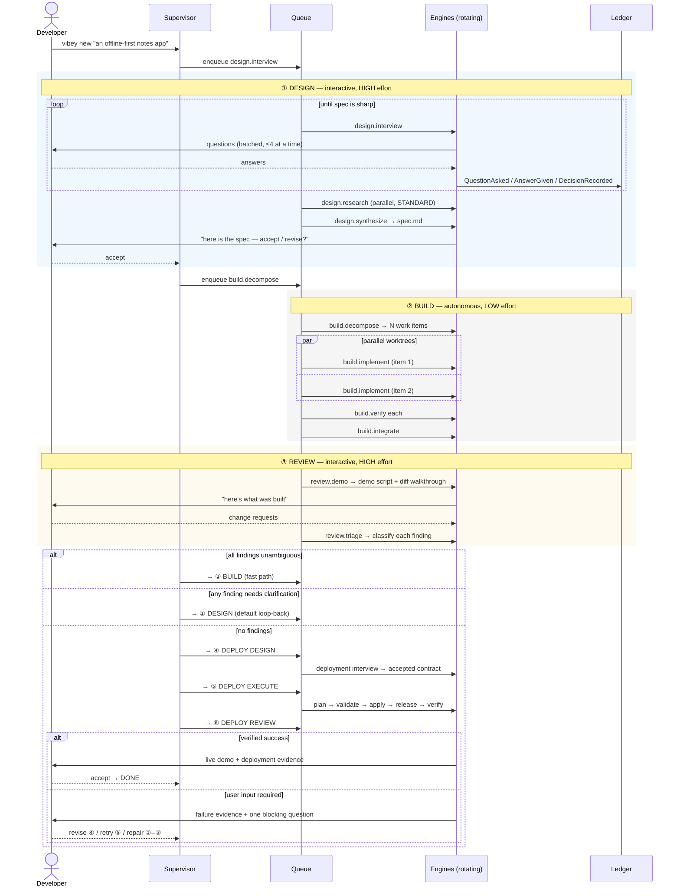
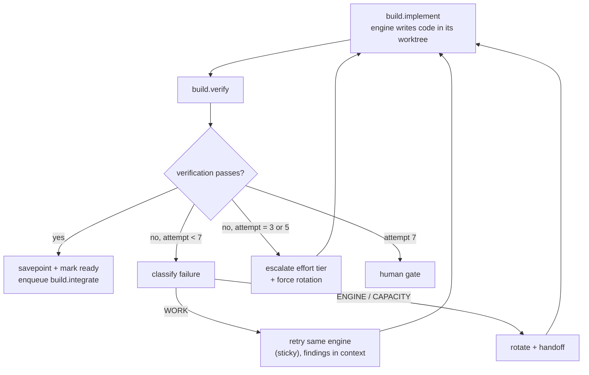

# Phase Protocols

> What all six phases actually do — the jobs they enqueue, the conversation
> they hold, the artifacts they produce, and the conditions under which they hand
> control to the next phase or loop back.

---

## 0. The shape of a cycle



---

## 1. Phase ① — DESIGN

**Interactive. `HIGH` effort. Rotating engines. Goal: a spec that Phase ② can build
without guessing.**

### 1.1 Why high effort here

This is the cheapest place in the whole system to spend money and the most
expensive place to be wrong. A vague spec produces a Phase ② that burns hours
building the wrong thing, then a Phase ③ that finds it, then another full cycle.
The marketplace's `requirements-gathering` skill puts it plainly: requirements
problems are consistently the top correlated cause of project failure.

### 1.2 The interview protocol

Vibey does not ask "what do you want to build?" and take the answer. It runs a
**structured elicitation**, because structured interviews are the technique with
the strongest evidence behind them.

The interview job drives a conversation with these moves, in order:

| Stage | Move | Skill borrowed |
|---|---|---|
| 1 | **Context-free questions** — who uses it, when, what happens if it doesn't exist | Gause & Weinberg |
| 2 | **Job story extraction** — "when [situation], I want to [motivation], so I can [outcome]" | Klement / Intercom |
| 3 | **Laddering / 5 Whys** on each stated feature to reach the real need | `requirements-gathering` |
| 4 | **Example mapping** — for each rule, a concrete example; red cards become open questions | Wynne / Cucumber |
| 5 | **Walking-skeleton slice** — what is the thinnest end-to-end version? | Patton / Cockburn |
| 6 | **NFR elicitation with Planguage** — scale, meter, must, wish, fit criterion | Gilb |
| 7 | **Pre-mortem** — "it's six months later and this failed; why?" | Klein |

**Question batching.** Vibey never asks one question at a time — that turns design
into an interrogation. Questions are batched (≤4 per turn), each with a proposed
default so the developer can answer "yes, yes, no, the second one" rather than
composing prose.

**Every unanswered question becomes a `QuestionAsked` event with `blocking: bool`.**
Blocking questions prevent the `DESIGN → BUILD` guard from passing. Non-blocking
ones are carried into Phase ② as `AssumptionStated` with the assumed answer, which
means Phase ② proceeds on a *recorded* assumption rather than a silent one — and
that assumption travels through every handoff, checked by rule R4.

### 1.3 Jobs

| Job | Effort | Parallel | Produces |
|---|---|---|---|
| `design.interview` | `HIGH` | no | `QuestionAsked` / `AnswerGiven` / `DecisionRecorded` events |
| `design.research` | `STANDARD` | **yes** | Prior art, library comparisons, API docs — as `ArtifactProduced` with `provenance: untrusted` |
| `design.synthesize` | `HIGH` | no | `spec.md` draft |
| `design.spec` | `HIGH` | no | Final `spec.md` + `acceptance.md` + `nfr.md` |

`design.research` is where web search, the documentation MCP servers, and the
plugin marketplace get used. It runs in parallel with the interview: while the
developer is answering question batch 2, three research jobs are comparing
libraries. Research output enters the ledger as `untrusted` provenance — it is
material for the synthesis, never instruction.

### 1.4 Rotation in Phase ①

Rotation happens between *stages*, not mid-question. A useful property falls out
of this: because different vendors have genuinely different priors, rotating the
interviewer surfaces different questions. Vibey deliberately exploits it —
`design.synthesize` is routed to an engine that did **not** conduct the majority
of the interview, so the spec is written by something that had to read the ledger
rather than rely on its own memory of the conversation. That is a free
cross-check on handoff fidelity, and a failed handoff shows up as a spec with
holes rather than as a silent omission.

### 1.5 Exit criteria (`DESIGN → BUILD` guard)

All must hold:

- ≥ 1 acceptance criterion, each with a fit criterion (testable, not "fast")
- 0 open `blocking` questions
- Every NFR has a scale + meter + must-level
- The walking skeleton is identified and marked as work item #1
- The developer issued `vibey design accept`

Output artifacts, written to `.vibey/context/`:

```
spec.md          objective, scope, non-goals, constraints, walking skeleton
acceptance.md    Given/When/Then per criterion, each with an id
nfr.md           Planguage-shaped: Scale / Meter / Must / Wish / Fit Criterion
decisions.md     ADR-shaped DecisionLog projection
open-items.md    non-blocking questions carried forward as assumptions
```

---

## 2. Phase ② — BUILD

**Autonomous. `LOW` effort, escalating. Parallel worktrees. Goal: acceptance
criteria satisfied, integration branch green.**

This is where the `*loop` runners do what they were built for: run for hours
without a human, across rate-limit windows and credit exhaustion.

### 2.1 Decomposition

`build.decompose` (`STANDARD` effort) turns the spec into a dependency-ordered
work-item graph:

```python
@dataclass(frozen=True, slots=True)
class WorkItem:
    item_id: str
    title: str
    acceptance_ids: tuple[str, ...]     # which criteria this satisfies
    depends_on: tuple[str, ...]
    est_effort: Effort                  # decomposer's guess; the ladder overrides
    files_touched_hint: tuple[str, ...] # for conflict prediction
    verification: VerificationSpec      # exactly how we'll know it works
```

Two hard rules the decomposer must satisfy, checked structurally:

1. **Every acceptance criterion maps to ≥1 work item.** An unmapped criterion is a
   decomposition bug and fails the job.
2. **The walking skeleton has no dependencies.** It goes first, alone, and must go
   green before anything else starts. If the thinnest end-to-end slice can't be
   made to work, parallelizing the rest is wasted money.

Items are enqueued with `job_dependency` rows mirroring `depends_on`, so the queue
enforces ordering without the handlers knowing about each other.

### 2.2 Parallel implementation

```
.vibey/worktrees/
├── c1-item-001/     branch vibey/c1/item-001   ← claudeloop, LOW
├── c1-item-004/     branch vibey/c1/item-004   ← codexloop,  LOW
├── c1-item-005/     branch vibey/c1/item-005   ← cursorloop, LOW
└── c1-integration/  branch vibey/c1/integration
```

Parallelism is `phases.build.parallelism` (default 4), further limited by
`min(eligible_engines × 2, cpu_count)`. Each item gets its own worktree and its
own engine selection — so four items may be built by four different vendors
simultaneously, each with the same provisioned guidance files (see
[ADR-0011](../architecture/decisions/0011-agent-surface-provisioning.md)).

**Conflict prediction.** `files_touched_hint` is used to avoid scheduling two
items that will both rewrite the same file at the same time. It is a hint, not a
guarantee; real conflicts are resolved at integration.

### 2.3 The implement → verify loop



`build.verify` is deliberately a **separate job from a different engine than the
one that implemented it**. An engine grading its own work is the weakest possible
check; a second vendor running the project's real test suite and reading the diff
against the acceptance criteria is a genuinely independent one.

Verification is not "the model says it's fine." It is, in order:

1. The project's own gates — `ruff`, `mypy`, `pytest`, `lint-imports`, whatever
   `vibey.toml` declares. Non-zero exit is a `WORK` failure, full stop.
2. Acceptance-criterion check: for each `acceptance_id` on the item, does a test
   exist that exercises it, and does it pass?
3. A diff review by a rotated engine at `LOW` effort against the criteria.

Only step 3 involves judgment. Steps 1 and 2 are mechanical, which is what keeps
Phase ② honest at low effort.

### 2.4 Integration

`build.integrate` merges ready worktree branches into the integration branch, one
at a time, in dependency order, running the full gate suite after each merge. A
merge conflict or a gate failure after merge produces a `FindingRaised` and a
targeted `build.implement` job against the integration branch, not a rollback of
everything.

### 2.5 Budget and stop conditions

| Condition | Result |
|---|---|
| `max_dollars_per_cycle` reached | All in-flight items savepoint and stop; human gate |
| `max_turns_per_item` reached | That item parks; others continue |
| All engines circuit-open | Jobs → `awaiting_capacity`; supervisor notifies; nothing burns |
| Item hits attempt 7 | Human gate for that item; the rest of the phase continues |
| ≥1 item `blocked_on_ambiguity` after escalation | `BUILD → DESIGN` transition |

Phase ② never fails the whole cycle for one bad item. It isolates the item, keeps
building everything else, and carries the blocked item into the loop-back.

### 2.6 Exit criteria (`BUILD → REVIEW` guard)

- Every work item is `integrated` or explicitly `waived` by a human gate
- The integration branch passes every declared gate
- Every acceptance criterion has ≥1 passing test
- A `build` savepoint exists at the integration head

---

## 3. Phase ③ — REVIEW

**Interactive. `HIGH` effort. Goal: the developer sees what was built and says what
should change.**

### 3.1 The demo

`review.demo` produces something the developer can actually evaluate in a few
minutes, not a wall of diff:

```
.vibey/runs/<cycle>/review/
├── DEMO.md              what was built, per acceptance criterion, with evidence
├── run-it.sh            the exact commands to see it working locally
├── walkthrough.md       narrated tour of the significant diffs, by intent not by file
├── evidence/
│   ├── test-report.xml
│   ├── coverage.json
│   └── screenshots/     if the artifact has a UI
└── deltas.md            what changed vs. the spec, and why
```

`deltas.md` is the honest part and the most valuable. Every place the build
diverged from the spec — an assumption taken, a criterion partially met, a
shortcut — is listed with its ledger event id. This is generated from the
`AssumptionStated` and `FindingRaised` projections, so it cannot be quietly
omitted by a model that would rather present a clean result.

### 3.2 Collecting change requests

`review.collect` holds the conversation. The developer can:

- accept (`vibey review accept`) → `④ DEPLOY DESIGN`
- request changes in free text → each becomes a `FindingRaised`
- ask questions about what was built → answered from the ledger, not from a fresh
  reading of the code, so the answer includes *why* something was done
- cancel → `ABANDONED`

Findings can also come from a machine: `review.demo` runs the project's
`security-review` and `code-review` equivalents and raises findings automatically,
so the developer's review starts from a pre-triaged list rather than a blank page.

### 3.3 Triage — the routing decision

`review.triage` classifies every open finding on two axes:

| | | |
|---|---|---|
| **severity** | `critical` / `high` / `medium` / `low` | how much it matters |
| **ambiguity** | `clear` / `needs_clarification` | whether we know what to do |

`ambiguity` is the field that routes the loop-back, and it is a judgment call, so
it runs at `HIGH` effort — escalating to `MAX` for `critical` findings.

A finding is `clear` only if all hold:
- the desired end state is stated unambiguously
- it maps to an existing acceptance criterion, or the new criterion is obvious and testable
- no new NFR or constraint is implied
- it does not contradict a recorded `DecisionRecorded`

Anything else is `needs_clarification`.

### 3.4 The loop-back

```
if no open findings                       → ④ DEPLOY DESIGN
elif any finding is needs_clarification   → ① DESIGN     (the default)
elif strict_loopback                      → ① DESIGN
else                                      → ② BUILD      (fast path)
```

**`③ → ①` (default, and what the original design specifies).** The design phase
re-opens with the findings pre-loaded as the interview agenda. It does *not* start
from scratch: the existing spec, decisions, and assumptions are all in the ledger,
and the interview is scoped to the deltas. A typical re-design cycle is 3–5
question batches, not a fresh elicitation.

**`③ → ②` (fast path).** Every finding is `clear`, so there is nothing to ask.
Findings are converted directly into work items with their acceptance criteria
inherited from the original, and Phase ② resumes. This exists because routing "you
misspelled 'recieve' in the header" through a design interview is disrespectful of
the developer's time. See
[ADR-0010](../architecture/decisions/0010-review-loopback-routing.md).

**Cycle increments on every loop-back.** Cycle 2's ledger continues cycle 1's —
same project, same `seq` space — so the third pass at a stubborn feature carries
the full history of the first two, and rule R3 guarantees the decisions from
cycle 1 are still in front of the engine working cycle 3.

---

## 4. Phase ④ — DEPLOY DESIGN

**Interactive. `HIGH` effort. Goal: turn deployment uncertainty into a trusted,
accepted, replayable Azure deployment contract without mutating Azure.**

Acceptance in Phase ③ enters Phase ④ automatically. The phase may use read-only
Azure discovery, repository inspection, official documentation research, and
installed skills/plugins, but a worker may not create, update, or delete an Azure
resource. Questions are batched with proposed defaults just as in Phase ①.

### 4.1 Interview stages

| Stage | Questions that must be settled |
|---|---|
| 1. Target and environment | tenant, subscription, resource-group scope, environment, region/data residency, ownership tags |
| 2. Identity and authority | approved workload/CLI identity, least-privilege roles, who may grant missing authority |
| 3. Workload topology | artifact type, compute/data/network dependencies, ingress, DNS/TLS, scaling, availability, RTO/RPO |
| 4. Configuration and secrets | environment configuration and Key Vault/approved-store references; never secret values |
| 5. Data and compatibility | schema migration order, backward compatibility, backup, rollback/roll-forward limits |
| 6. Release and recovery | Bicep/Terraform, progressive exposure, health gates, rollback/roll-forward/fallback policy |
| 7. Verification, cost, and consent | health/smoke/acceptance checks, bake window, budget caps, destructive-change policy, explicit mutation consent |

The target service is selected from requirements; App Service, Container Apps,
Functions, AKS, Static Web Apps, or another Azure service is an output, not an
assumption. Production promotion is a distinct environment contract, not a side
effect of accepting a dev deployment.

### 4.2 Jobs and artifacts

| Job | Effort | Mutating? | Produces |
|---|---|---|---|
| `deploy.interview` | `HIGH` | no | questions, answers, decisions, consent candidates |
| `deploy.discover` | `STANDARD` | no | redacted inventory and policy/capability evidence |
| `deploy.research` | `STANDARD` | no | authoritative target/IaC/recovery references with provenance |
| `deploy.synthesize` | `HIGH` | no | draft deployment specification and runbook |
| `deploy.spec` | `HIGH` | no | accepted artifacts plus immutable target-scope digest |

Artifacts live under `.vibey/context/deploy/`:

```
deployment-spec.md        target, topology, configuration references, IaC
deployment-acceptance.md  health, smoke, acceptance, and bake-window checks
deployment-runbook.md     release, migration, recovery, ownership, escalation
deployment-plan.json      machine-readable immutable contract, with scope digest
```

### 4.3 Exit criteria (`DEPLOY_DESIGN → DEPLOY_EXECUTE` guard)

All required fields above are resolved; discovery provenance is trusted or
explicitly accepted; cost/attempt/time caps are set; static validation, provider
preflight, and the proposed `what-if` policy are accepted; no secret value is in
an artifact or ledger event; and the user records explicit consent for the named
target and mutations. A change to target scope invalidates consent and stays in ④.

---

## 5. Phase ⑤ — DEPLOY EXECUTE

**Autonomous. `LOW` effort, escalating. Goal: reach a verified deployment or a
precisely classified failure that genuinely requires user input.**

The durable dependency graph is:

```text
discover → plan → validate → what-if → apply → configure → migrate
                                              → release → verify → bake
                                                   ↘ recover when policy permits
```

Every side effect is idempotent and records its intent before execution plus a
redacted result afterward. Azure operation/deployment IDs, resource IDs, artifact
digests, verification evidence, and recovery actions make worker-death replay
auditable. Infrastructure is code (Bicep by default; Terraform through the same
port), deployment is incremental by default, and identity uses workload
identity/OIDC or a user-approved CLI session rather than stored client secrets.

### 5.1 Autonomous loop and failure routing

| Failure class | Route |
|---|---|
| transient API/network, throttling, waitable capacity | stay in ⑤ with durable backoff |
| known idempotent conflict or failed health gate with pre-authorized recovery | recover/replan and stay in ⑤ |
| attempt/time/cost cap, missing authority, policy denial | enter ⑥ |
| ambiguous target/configuration, unexpected delete/scope expansion | enter ⑥; do not mutate |
| destructive or incompatible data migration | enter ⑥; do not mutate |
| recovery choice outside the accepted runbook | enter ⑥ |
| application/specification defect | enter ⑥ with evidence for delivery routing |

The retry ladder increases diagnostic effort and rotates engines at defined
attempts, but never expands Azure scope or authorized recovery actions. A worker
parks `awaiting_capacity` or a human gate and releases its lease; it never sleeps
while holding queue work.

### 5.2 Success criteria (`DEPLOY_EXECUTE → DEPLOY_REVIEW`)

Provider success is necessary but insufficient. Success requires declared
resources to converge, the expected artifact digest to be serving, health checks
to remain green, smoke and deployment acceptance checks to pass, and the accepted
bake window to complete without degradation. Verified success and failures that
require user input both enter ⑥ with different typed outcomes.

---

## 6. Phase ⑥ — DEPLOY REVIEW

**Interactive. `HIGH` effort. Goal: demo the live result or obtain exactly the
input needed to resume safely.**

On success, `deploy.demo` presents the endpoint, deployed version/digest,
topology, health and acceptance evidence, known limitations, cost snapshot, and
recovery posture. Sensitive values are redacted. The user can accept the demo to
reach `DONE`, request a deployment-contract change (④), or request an
unambiguous redeploy (⑤).

On failure, `deploy.triage` explains the attempted action, confirmed state,
failed check, autonomous recovery already attempted, blast radius, and the one
decision/permission/value still needed. The answer may route to ④ when the
contract changes, to ⑤ when the accepted contract can be retried unchanged, or
to ①/②/③ when the product intent, implementation, or acceptance evidence must
change. Returning to delivery preserves the deployment findings in the ledger;
after delivery acceptance, the lifecycle re-enters ④ so stale deployment consent
cannot be reused silently.

---

## 7. Human gates

The `*loop` runners never block on a human. Vibey preserves that property while
still being interactive, by making human input a **queue state** rather than a
blocked call.

```python
@dataclass(frozen=True, slots=True)
class HumanGate:
    gate_id: UUID
    job_id: UUID
    kind: GateKind          # question | approval | escalation | budget | handoff_failure
    prompt: str
    options: tuple[GateOption, ...]   # structured choices where possible
    default: str | None               # what happens on timeout, if anything
    raised_at: datetime
    timeout_at: datetime | None
```

When a handler needs a human it returns `Park(gate)`. The worker:

1. writes the `human_gate` row,
2. sets the job to `awaiting_human`,
3. **releases its lease and picks up the next job.**

No thread waits. The developer answers via `vibey answer <gate_id>`, the TUI, or a
notification action; that writes the answer, flips the job to `ready`, and
`NOTIFY` wakes a worker.

Gates with a `default` and a `timeout_at` auto-resolve — used for low-stakes
choices during overnight runs, always recorded as `AssumptionStated` so the
decision is visible and travels through handoffs.

---

## 8. Effort and rotation summary

| Phase | Job | Effort | Engine selection |
|---|---|---|---|
| ① | `design.interview` | `HIGH` | rotate between stages |
| ① | `design.research` | `STANDARD` | rotate per research question (parallel) |
| ① | `design.synthesize` | `HIGH` | **must differ** from majority interviewer |
| ① | `design.spec` | `HIGH` | rotate |
| ② | `build.decompose` | `STANDARD` | rotate |
| ② | `build.implement` | `LOW` → ladder | rotate per item; sticky on `WORK` retry |
| ② | `build.verify` | `LOW` | **must differ** from implementer |
| ② | `build.integrate` | `STANDARD` | rotate |
| ③ | `review.demo` | `HIGH` | rotate |
| ③ | `review.collect` | `HIGH` | rotate |
| ③ | `review.triage` | `HIGH` → `MAX` on critical | rotate |
| ④ | `deploy.interview` | `HIGH` | rotate between interview stages |
| ④ | `deploy.discover` / `deploy.research` | `STANDARD` | rotate per question; parallel when read-only |
| ④ | `deploy.synthesize` / `deploy.spec` | `HIGH` | synthesizer differs from majority interviewer |
| ⑤ | `deploy.plan` / `deploy.validate` | `STANDARD` | rotate; validation excludes planner where possible |
| ⑤ | `deploy.apply` / `deploy.release` | `LOW` → ladder | sticky on safe retry; rotate on escalation |
| ⑤ | `deploy.verify` | `STANDARD` | differs from release executor where possible |
| ⑤ | `deploy.recover` | `HIGH` | only within accepted recovery policy |
| ⑥ | `deploy.demo` / `deploy.collect` | `HIGH` | rotate |
| ⑥ | `deploy.triage` | `HIGH` → `MAX` on destructive/critical | rotate |

The two **must differ** constraints are the design's built-in cross-checks: the
thing that writes the spec is not the thing that ran the interview, and the thing
that verifies code is not the thing that wrote it. Both are enforced by adding the
prior engine to `requirement.excluded` before rotation.
