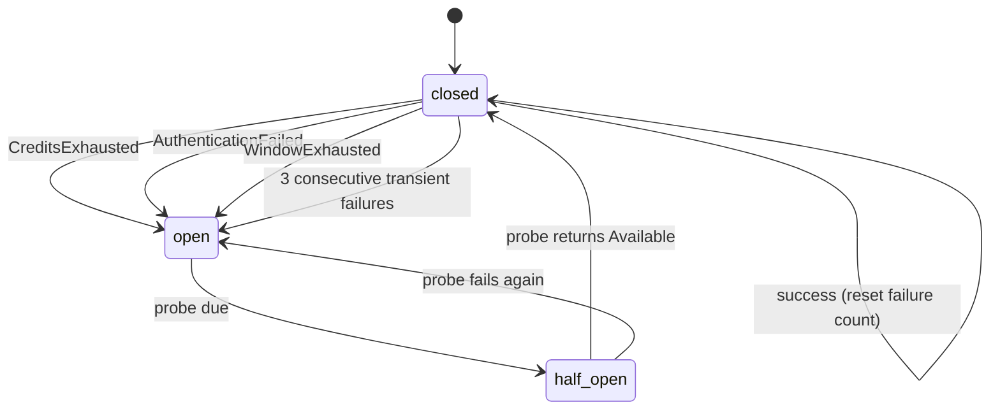

# Engine Rotation and the Capability Matrix

> How vibey picks which AI does the next piece of work, in every phase, without
> starving an engine, without pretending they are interchangeable, and without
> conflating "out of tokens for five minutes" with "out of money until you pay."

---

## 1. The verified divergence

The four runners look like siblings — same onion architecture, same `run` /
`resume` / `doctor` / `stop` / `prompt` verbs, same run-directory layout, same
capacity ADT. They are *not* interchangeable at the flag level. This table is
built from reading their sources, not their docs:

| Concern | `claudeloop` | `codexloop` | `cursorloop` | `agyloop` |
|---|---|---|---|---|
| Effort vocabulary | `Literal["low","medium","high","xhigh","max"]` | `StrEnum{LOW,MEDIUM,HIGH}` | **none** — a model-id ladder | `Literal["low","medium","high","xhigh","max"]` |
| Preset tiers | `low/medium/high` → model aliases | none | `_PRESET_LADDER` of model ids | `low/medium/high` → model aliases |
| Model ladder | sonnet → opus → fable | codex models | `composer-fast → composer → grok-4.5 → grok → grok-xhigh` | flash-lite → flash → pro |
| Router models | — | — | `router-cost / router-balanced / router-intelligence` | — |
| Top-level `effort` cmd | ✅ | ✅ | ❌ | ❌ |
| Top-level `preset` cmd | ✅ | ❌ | ❌ | ✅ |
| `savepoints` / `unwind` | ✅ | ✅ | ✅ | `unwind` only |
| Session listing verb | `sessions` | `threads` | `agents` | `sessions` |
| Sandbox / permission | `permission-mode` | `sandbox` + `approval` | hooks policy | `--safe` / `--yolo` |
| Structured verdict | ✅ (`output_format`) | ✅ | partial | ✅ |
| State dir | `.claudeloop/` | `.codexloop/` | `.cursorloop/` | `.agyloop/` |
| Done marker | `CLAUDELOOP_TASK_FULLY_COMPLETE` | `CODEXLOOP_…` | `CURSORLOOP_…` | `AGYLOOP_…` |
| Auth | `ANTHROPIC_*` | `OPENAI_API_KEY` / login | `CURSOR_API_KEY` | `GOOGLE_API_KEY` / ADC |

**The consequence:** any design that assumes `--effort high` works everywhere
breaks the first time the rotator picks `cursorloop`. Vibey handles this
explicitly rather than defensively.

---

## 2. The engine descriptor

```python
@dataclass(frozen=True, slots=True)
class EngineDescriptor:
    engine_id: EngineId
    binary: str                          # "claudeloop"
    min_version: str                     # semver floor the conformance suite asserts
    state_dir: str                       # ".claudeloop"
    done_marker: str
    auth_env: tuple[str, ...]
    capabilities: frozenset[Capability]
    effort_projection: Mapping[Effort, EngineInvocation]
    session_verb: str                    # "sessions" | "threads" | "agents"
    isolation_flags: Mapping[IsolationLevel, tuple[str, ...]]
    cost_per_mtok: CostModel
    context_window: int
    base_weight: int


@dataclass(frozen=True, slots=True)
class EngineInvocation:
    """Native flags that realize a requested vibey effort on this engine."""
    argv: tuple[str, ...]
    achieved: Effort          # may be < requested → saturation
    notes: str = ""


class Capability(StrEnum):
    SAVEPOINTS       = "savepoints"
    UNWIND           = "unwind"
    STRUCTURED_VERDICT = "structured_verdict"
    MID_RUN_PROMPT   = "mid_run_prompt"
    MID_RUN_MODEL    = "mid_run_model"
    MID_RUN_EFFORT   = "mid_run_effort"
    ATTACHMENTS      = "attachments"
    SLASH_COMMANDS   = "slash_commands"
    WEB_SEARCH       = "web_search"
    SNAPSHOT         = "snapshot"
    SANDBOX          = "sandbox"
```

Descriptors live in `infrastructure/engines/descriptors/*.py`. They are **data,
not code paths** — a fifth engine is a new descriptor plus an adapter, with no
change to `domain/rotation.py`.

---

## 3. The normalized effort ladder

Vibey's domain speaks five levels and nothing else:

```python
class Effort(IntEnum):
    TRIVIAL  = 0   # extraction, classification, formatting
    LOW      = 1   # bulk implementation — the Phase 2 default
    STANDARD = 2   # decomposition, integration, research
    HIGH     = 3   # design + review conversations — the Phase 1/3 default
    MAX      = 4   # hardest reasoning; contested specs, critical findings
```

Each descriptor projects those onto native flags. Saturation is explicit:

```python
# claudeloop — full 5-level range
{
  Effort.TRIVIAL:  EngineInvocation(("--preset","low","--effort","low"),      Effort.TRIVIAL),
  Effort.LOW:      EngineInvocation(("--preset","low","--effort","medium"),   Effort.LOW),
  Effort.STANDARD: EngineInvocation(("--preset","medium","--effort","high"),  Effort.STANDARD),
  Effort.HIGH:     EngineInvocation(("--preset","high","--effort","high"),    Effort.HIGH),
  Effort.MAX:      EngineInvocation(("--preset","high","--effort","max"),     Effort.MAX),
}

# codexloop — 3-level effort, saturates at HIGH
{
  Effort.TRIVIAL:  EngineInvocation(("--effort","low"),    Effort.TRIVIAL),
  Effort.LOW:      EngineInvocation(("--effort","low"),    Effort.LOW),
  Effort.STANDARD: EngineInvocation(("--effort","medium"), Effort.STANDARD),
  Effort.HIGH:     EngineInvocation(("--effort","high"),   Effort.HIGH),
  Effort.MAX:      EngineInvocation(("--effort","high"),   Effort.HIGH,
                                    notes="saturates: no tier above high"),
}

# cursorloop — no effort flag at all; position on the model ladder
{
  Effort.TRIVIAL:  EngineInvocation(("--model","composer-fast"), Effort.TRIVIAL),
  Effort.LOW:      EngineInvocation(("--model","composer"),      Effort.LOW),
  Effort.STANDARD: EngineInvocation(("--model","grok-4.5"),      Effort.STANDARD),
  Effort.HIGH:     EngineInvocation(("--model","grok"),          Effort.HIGH),
  Effort.MAX:      EngineInvocation(("--model","grok-xhigh"),    Effort.MAX),
}

# agyloop — full 5-level range
{ ... same shape as claudeloop with gemini aliases ... }
```

`achieved < requested` is not an error. It reduces that engine's rotation weight
via `fidelity_factor` (§5.3) and is reported in `vibey status` so the developer can
see that a `MAX` request was served at `HIGH`. Hiding saturation would be the
actual bug.

---

## 4. Phase effort policy

The user's requirement, made concrete:

| Phase | Base effort | Rationale |
|---|---|---|
| ① DESIGN | `HIGH` | The conversation that determines what gets built. Cheapest place to spend money; most expensive place to be wrong. |
| ② BUILD | `LOW` | Bulk, well-specified, verifiable work. Volume phase — this is where cost lives. |
| ③ REVIEW | `HIGH` | Judging whether the thing is right, and classifying ambiguity for the loop-back. |

### 4.1 The Phase 2 escalation ladder

A flat `LOW` would strand the one genuinely hard item. Escalation is **per work
item**, triggered by verification failure, and resets on success:

```
attempt 1–2 : LOW
attempt 3–4 : STANDARD    (+ rotate engine)
attempt 5–6 : HIGH        (+ rotate engine, force fresh worktree from last savepoint)
attempt 7   : human gate  ("this item has resisted 3 engines at 3 effort tiers")
```

Each escalation step also forces a rotation, so the ladder tries *different
engines at higher effort* rather than the same engine trying harder. The handoff
carries every failed attempt's findings, so engine 3 at `HIGH` starts knowing what
engines 1 and 2 already tried and why it failed.

### 4.2 Escalation is bounded by budget

An escalation that would exceed `max_dollars_per_cycle` does not happen; the item
parks on a human gate instead. Runaway agent cost is a documented incident class,
and the ladder is exactly the mechanism that could cause it, so the cap is checked
*before* the escalation, not after.

---

## 5. The rotation algorithm

### 5.1 Why not modulo

`engines[i % len(engines)]` is the obvious implementation and is wrong here for
three reasons:

1. **The eligible set changes size** as circuits open and close. Modulo over a
   shrinking list re-maps every index, so the cursor jumps arbitrarily.
2. **It ignores weight.** A faster/cheaper/more capable engine should get more
   work, and weights are how a developer expresses that.
3. **It clumps under weight.** Naive weighted round-robin (`AAABBC`) sends three
   consecutive items to A, which is exactly the pattern that exhausts A's
   rate-limit window while B and C sit idle.

### 5.2 Smooth Weighted Round Robin

Vibey uses nginx's SWRR, which produces `ABACAB` rather than `AAABBC` for weights
`{A:3, B:2, C:1}`:

```python
def select(candidates: Sequence[Candidate]) -> tuple[EngineId, tuple[Candidate, ...]]:
    """Pure. Returns the winner and the updated candidate states."""
    total = sum(c.effective_weight for c in candidates)
    if total <= 0:
        raise NoEligibleEngine
    advanced = tuple(
        replace(c, current=c.current + c.effective_weight) for c in candidates
    )
    winner = max(advanced, key=lambda c: (c.current, -c.order))   # order breaks ties deterministically
    updated = tuple(
        replace(c, current=c.current - total) if c.engine_id == winner.engine_id else c
        for c in advanced
    )
    return winner.engine_id, updated
```

State (`current` per engine) lives in the `rotation_cursor` table, updated in the
same transaction as the job lease, so a crash cannot double-advance the cursor.

### 5.3 Effective weight

```
effective_weight = max(0, round(
      base_weight
    × health_factor
    × fidelity_factor
    × cost_factor
    × affinity_factor
))
```

| Factor | Range | Meaning |
|---|---|---|
| `base_weight` | 1–10, from `vibey.toml` | Developer's stated preference |
| `health_factor` | 0.0–1.0 | `1.0` closed, `0.0` open, `0.25` half-open. Also decays on recent transient failures (EWMA over the last 20 turns) |
| `fidelity_factor` | 0.5–1.0 | `1.0` if `achieved == requested`; `0.7` if one tier below; `0.5` if two or more |
| `cost_factor` | 0.5–1.5 | Relative $/Mtok against the eligible set's median, inverted and clamped. Off by default (`cost_aware = false`) |
| `affinity_factor` | 1.0 or 2.0 | `2.0` when this engine already holds a warm session for this work item and rotation is not forced (stickiness) |

All five are pure functions in `domain/rotation.py` with individual unit tests.

### 5.4 Eligibility

```python
def eligible(
    engines: Sequence[EngineRuntime],
    *,
    requirement: JobRequirement,
    phase: Phase,
    allow_list: frozenset[EngineId] | None,
    now: datetime,
) -> tuple[EngineRuntime, ...]:
    return tuple(
        e for e in engines
        if e.installed
        and e.conformance_ok
        and e.auth_ok_at is not None and now - e.auth_ok_at < AUTH_TTL
        and e.circuit.state is not CircuitState.OPEN
        and requirement.capabilities <= e.descriptor.capabilities
        and (allow_list is None or e.engine_id in allow_list)
        and e.engine_id not in requirement.excluded
    )
```

Note `requirement.capabilities <= descriptor.capabilities`: a job that needs
`SAVEPOINTS` will never be routed to an engine whose descriptor omits it. This is
the concrete payoff of the capability matrix — the divergence in §1 becomes a
routing constraint rather than a runtime crash.

If the eligible set is empty, the job moves to `awaiting_capacity` (not `failed`)
and is woken by `LISTEN`/`NOTIFY` when any circuit half-opens.

---

## 6. Circuit breakers

### 6.1 States and transitions



### 6.2 Probe timing — where credits ≠ rate limit lives

This is the `*loop` family's hardest-won distinction, and vibey must not soften it:

| Capacity state | Probe due at | Rationale |
|---|---|---|
| `WindowExhausted(resets_at)` | `resets_at` (+ small jitter) | A window has a clock. Waiting to the deadline is correct and free. |
| `WindowExhausted(resets_at=None)` | exponential backoff, cap 5 min | RPM-class throttle with no stated reset. Short bounded backoff. |
| `CreditsExhausted` | exponential backoff from 5 min, **cap 30 min, no deadline** | **There is no reset time.** Only a human top-up changes this. Vibey probes so it notices a mid-wait top-up, and notifies the developer, but never computes a "will be fixed at" timestamp. |
| `AuthenticationFailed` | **never automatically** | Waiting cannot fix bad credentials. Requires `vibey doctor` to clear, and raises a human gate immediately. |

`CircuitState` carries no `resets_at` field for the credits case. This is enforced
by the type: `domain/circuit.py` models the probe schedule as
`ProbeSchedule = DeadlineProbe(at) | BackoffProbe(next_at, attempt)`, and
`CreditsExhausted` can only produce `BackoffProbe`. Making it a type error rather
than a convention is the point.

### 6.3 Failure attribution

Not every failure is the engine's fault. A `build.implement` job that fails
because the *code* doesn't compile must not open the engine's circuit — that would
mark a healthy engine unhealthy because the project has a bug.

```
FailureClass:
  CAPACITY     → circuit opens                 (provider said no)
  ENGINE       → circuit opens after 3         (crash, hang, malformed output)
  WORK         → circuit untouched             (tests failed, compile error)
  VIBEY        → circuit untouched, job retries (our bug)
```

Attribution happens in the adapter, which is the only layer that can tell a
non-zero exit code caused by `pytest` from one caused by the runner dying.

---

## 7. When rotation fires

| Trigger | Rotates? | Forced? | Handoff? |
|---|---|---|---|
| New work item claimed | yes | no | no (fresh context) |
| `CapacityRejected` mid-item | yes | **yes**, excludes rejector | **yes** |
| Effort escalation | yes | yes | yes |
| Engine crash / hang (`ENGINE` class) | yes | yes | yes |
| Phase transition | yes | no | yes (phase brief) |
| `vibey rotate --now` (operator) | yes | yes | yes |
| Work failure (`WORK` class) retry | **no** | — | no (keep warm session) |
| Mid-turn | **never** | — | — |

Stickiness (the `affinity_factor` of 2.0) is what makes "no" the answer for
ordinary retries. Rotating on every turn would mean a handoff on every turn:
maximum cost, maximum opportunity for the gate to have to work, zero benefit.
Vibey rotates when something *changed*.

**Never mid-turn** is a hard rule. A turn is the atomic unit against a live vendor
session; interrupting one leaves the vendor's session state and vibey's ledger
disagreeing, which is the one inconsistency the whole design is built to avoid.

---

## 8. The adapter

```python
class EngineAdapter(Protocol):
    """infrastructure/engines/ — the only place vendor CLI shapes exist."""

    @property
    def descriptor(self) -> EngineDescriptor: ...

    async def preflight(self) -> PreflightResult:
        """Run `<engine> doctor`; classify auth + availability."""

    async def start(self, spec: RunSpec) -> RunHandle:
        """Build argv from descriptor.effort_projection + isolation flags,
        spawn the runner, return a handle over its run directory."""

    async def tail(self, handle: RunHandle) -> AsyncIterator[EngineEvent]:
        """Stream the runner's events.jsonl, translated into vibey events."""

    async def send_prompt(self, handle: RunHandle, text: str, *, now: bool) -> None:
        """Write the runner's control-plane inbox (`prompt --now` / `--at-break`)."""

    async def stop(self, handle: RunHandle) -> StopSummary:
        """Soft-stop; collect stop-summary.md and the final snapshot."""

    async def snapshot(self, handle: RunHandle) -> SnapshotRef | None: ...

    def classify(self, raw: Mapping[str, object]) -> CapacityState:
        """Vendor error shape → vibey's capacity ADT."""

    def attribute(self, exit_code: int, tail: str) -> FailureClass: ...
```

### 8.1 What the adapter actually reads

Every runner writes the same run-directory shape (verified across all four):

```
.<engine>loop/runs/<run_id>/
├── meta.json          # run_id, pid, cwd, session_id, status, phase, attempt,
│                      # waiting_until, model, effort, preset, capacity
├── events.jsonl       # the runner's own event stream  ← vibey tails this
├── audit.jsonl
├── bus.jsonl
├── status.json
├── savepoints.jsonl
├── stop-summary.md
├── inbox/             # ← vibey writes control commands here
└── snapshots/
    ├── latest.json    # the handoff snapshot (schema_version 1)
    └── <ts>-<reason>.json
```

Vibey translates `events.jsonl` into ledger events and reads `snapshots/latest.json`
for the runner's own handoff payload — which is a strict subset of what vibey's
envelope needs, and is used as *input* to brief production, not as the brief.

### 8.2 The conformance suite

Because the four runners are pre-1.0, the descriptor is a claim that has to be
checked. `vibey doctor --conformance` asserts, per engine:

| Check | Assertion |
|---|---|
| `binary` | on `PATH`, `--version` ≥ `min_version` |
| `flags` | `run --help` contains every flag in `effort_projection` and `isolation_flags` |
| `state_dir` | a scripted trivial run creates `<state_dir>/runs/<id>/` |
| `run_dir_shape` | `meta.json`, `events.jsonl`, `snapshots/latest.json` all present |
| `snapshot_schema` | `latest.json.schema_version == 1` and required keys present |
| `capacity_map` | each simulated vendor error maps to the expected `CapacityState` |
| `done_marker` | the marker string matches the descriptor |
| `control_plane` | writing `inbox/` produces the documented effect |
| `structured_verdict` | if claimed, a scripted run returns parseable JSON |

A failing check sets `conformance_ok = false`, which makes the engine ineligible
(§5.4) — degraded, not broken. `vibey doctor` prints exactly which claim failed so
a descriptor can be corrected when a runner changes.

This suite is what lets vibey depend on four moving targets without becoming
brittle. It is run in CI (against `ScriptedEngine` fakes) and on every `vibey up`
(against whatever is actually installed).

---

## 9. Observability of rotation

Fairness claims are worthless if unmeasured. Vibey exports:

- `vibey_engine_selected_total{engine,phase,cycle}` — the empirical distribution;
  divide by weights and it should approach uniform.
- `vibey_engine_circuit_state{engine}` — 0 closed / 1 half-open / 2 open.
- `vibey_engine_saturation_total{engine,requested,achieved}` — how often `MAX` was
  served as `HIGH`.
- `vibey_handoff_gate_attempts` histogram, and
  `vibey_handoff_gate_violation_total{rule}` — which rules actually fire in
  practice, per engine pair.
- `vibey_engine_cost_usd{engine,phase}`.

`vibey engines` renders the same data as a table:

```
ENGINE       WEIGHT  EFF  CIRCUIT    SELECTED  SAT   $/CYCLE  LAST CAPACITY
claudeloop        3  3.0  closed          142   0%     18.40  Available
codexloop         2  1.4  half_open        61   9%      6.12  WindowExhausted → 14:22
cursorloop        2  2.0  closed           74   0%      7.80  Available
agyloop           1  0.0  open              9   —       1.05  CreditsExhausted (probe 12m)
```
